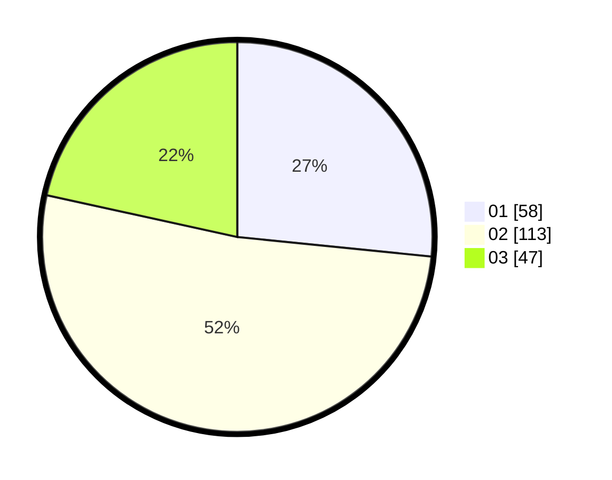

# Hasil

Hasil perolehan suara paslon dapat dilihat pada file paslon-01.txt, paslon-02.txt, dan paslon-03.txt.

Jika tidak ada, artinya data tersebut belum ada pada SIREKAP.

## Perolehan Suara

 * Paslon 01: **58**.
 * Paslon 02: **113**.
 * Paslon 03: **47**.

## Foto C Plano

https://sirekap-obj-formc.kpu.go.id/1912/pemilu/ppwp/31/73/05/10/07/3173051007106-20240215-042337--25b9c4ec-ba1c-46b1-a03b-80063f0fc855.jpg

https://sirekap-obj-formc.kpu.go.id/1912/pemilu/ppwp/31/73/05/10/07/3173051007106-20240215-021833--2dbcc3b3-74d8-4363-893b-03e444020891.jpg

https://sirekap-obj-formc.kpu.go.id/1912/pemilu/ppwp/31/73/05/10/07/3173051007106-20240215-015329--8ac59ec9-f1e8-442b-a7a3-1ea23e0a0bf8.jpg
