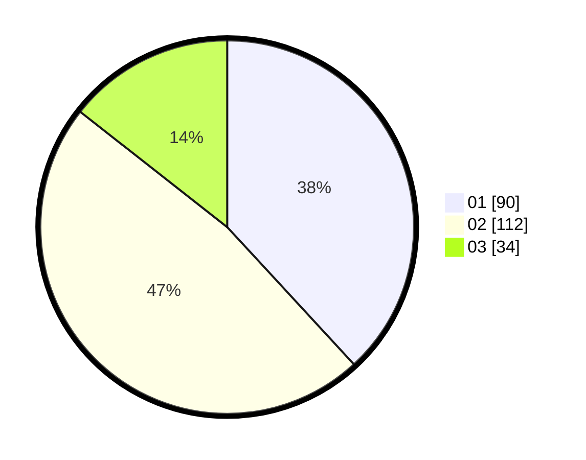

# Hasil

Hasil perolehan suara paslon dapat dilihat pada file paslon-01.txt, paslon-02.txt, dan paslon-03.txt.

Jika tidak ada, artinya data tersebut belum ada pada SIREKAP.

## Perolehan Suara

 * Paslon 01: **90**.
 * Paslon 02: **112**.
 * Paslon 03: **34**.

## Foto C Plano

https://sirekap-obj-formc.kpu.go.id/8770/pemilu/ppwp/31/73/05/10/07/3173051007108-20240214-160111--84368a11-4696-45e9-83c2-498728003f32.jpg

https://sirekap-obj-formc.kpu.go.id/8770/pemilu/ppwp/31/73/05/10/07/3173051007108-20240215-021128--b1b3b09a-77bf-47af-b448-c8d84ed25bf9.jpg

https://sirekap-obj-formc.kpu.go.id/8770/pemilu/ppwp/31/73/05/10/07/3173051007108-20240215-021214--2818e5f5-f448-40be-8abc-20611aa50cd6.jpg

## DATA PEMILIH TETAP

Jumlah pemilih dalam DPT: **276**.
 * L: **139**.
 * P: **137**.

## DATA PENGGUNA HAK PILIH

Jumlah pengguna hak pilih dalam DPT: **233**.
 * L: **112**.
 * P: **121**.

Jumlah pengguna hak pilih dalam DPTb: **8**.
 * L: **3**.
 * P: **5**.

Jumlah pengguna hak pilih dalam DPK: **0**.
 * L: **0**.
 * P: **0**.

Jumlah pengguna hak pilih: **241**.
 * L: **115**.
 * P: **126**.

## JUMLAH SUARA SAH DAN TIDAK SAH

JUMLAH SELURUH SUARA SAH: **236**.

JUMLAH SUARA TIDAK SAH: **5**.

JUMLAH SELURUH SUARA SAH DAN SUARA TIDAK SAH: **241**.
