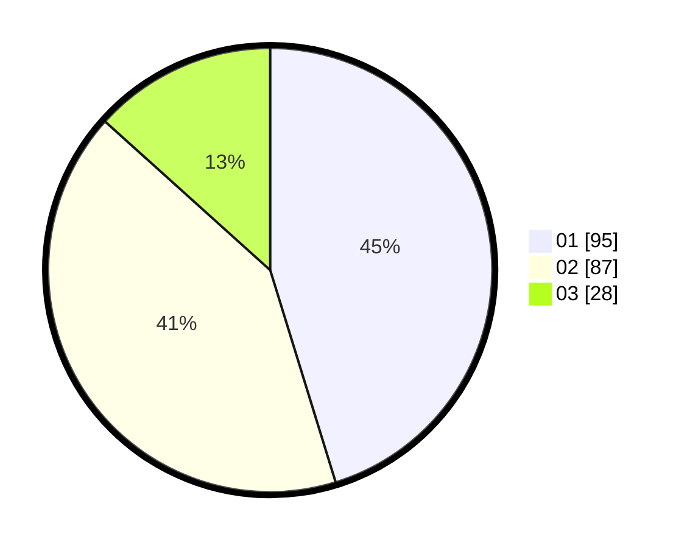

# Hasil

Hasil perolehan suara paslon dapat dilihat pada file paslon-01.txt, paslon-02.txt, dan paslon-03.txt.

Jika tidak ada, artinya data tersebut belum ada pada SIREKAP.

## Perolehan Suara

 * Paslon 01: **95**.
 * Paslon 02: **87**.
 * Paslon 03: **28**.

## Foto C Plano

https://sirekap-obj-formc.kpu.go.id/49ac/pemilu/ppwp/31/73/05/10/07/3173051007109-20240214-190346--9f09cc5e-6a8e-47b7-84f4-b7b7a20ce0cc.jpg

https://sirekap-obj-formc.kpu.go.id/49ac/pemilu/ppwp/31/73/05/10/07/3173051007109-20240214-190359--3a5b6ecf-b4ba-4a8f-b725-df2325e6409b.jpg

https://sirekap-obj-formc.kpu.go.id/49ac/pemilu/ppwp/31/73/05/10/07/3173051007109-20240214-190413--cf3b8f30-25e8-489d-a431-a8aef5a1ff58.jpg

## DATA PEMILIH TETAP

Jumlah pemilih dalam DPT: **263**.
 * L: **119**.
 * P: **144**.

## DATA PENGGUNA HAK PILIH

Jumlah pengguna hak pilih dalam DPT: **208**.
 * L: **95**.
 * P: **113**.

Jumlah pengguna hak pilih dalam DPTb: **4**.
 * L: **2**.
 * P: **2**.

Jumlah pengguna hak pilih dalam DPK: **1**.
 * L: **0**.
 * P: **1**.

Jumlah pengguna hak pilih: **213**.
 * L: **97**.
 * P: **116**.

## JUMLAH SUARA SAH DAN TIDAK SAH

JUMLAH SELURUH SUARA SAH: **210**.

JUMLAH SUARA TIDAK SAH: **3**.

JUMLAH SELURUH SUARA SAH DAN SUARA TIDAK SAH: **213**.
