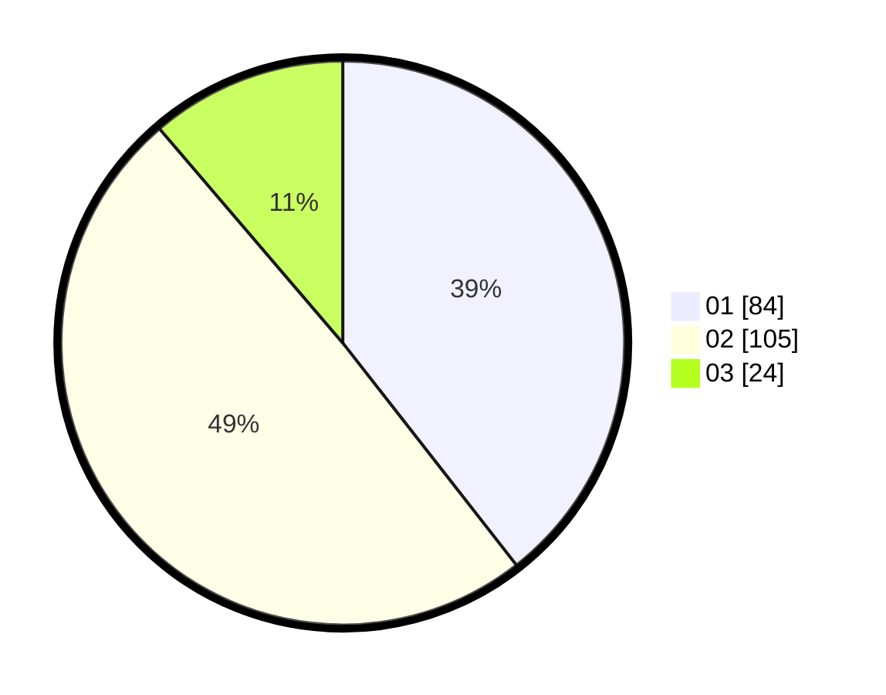

# Hasil

Hasil perolehan suara paslon dapat dilihat pada file paslon-01.txt, paslon-02.txt, dan paslon-03.txt.

Jika tidak ada, artinya data tersebut belum ada pada SIREKAP.

## Perolehan Suara

 * Paslon 01: **84**.
 * Paslon 02: **105**.
 * Paslon 03: **24**.

## Foto C Plano

https://sirekap-obj-formc.kpu.go.id/56cb/pemilu/ppwp/31/73/06/10/01/3173061001001-20240214-213119--bab360d3-888b-4d96-b165-3b7d8916928f.jpg

https://sirekap-obj-formc.kpu.go.id/56cb/pemilu/ppwp/31/73/06/10/01/3173061001001-20240215-225017--c27b16c6-5805-46dc-bfe0-69db25cfa0a5.jpg

https://sirekap-obj-formc.kpu.go.id/56cb/pemilu/ppwp/31/73/06/10/01/3173061001001-20240215-225017--3866a55f-91ba-4131-ac27-dd2d4d6aed78.jpg

## DATA PEMILIH TETAP

Jumlah pemilih dalam DPT: **201**.
 * L: **96**.
 * P: **105**.

## DATA PENGGUNA HAK PILIH

Jumlah pengguna hak pilih dalam DPT: **201**.
 * L: **96**.
 * P: **105**.

Jumlah pengguna hak pilih dalam DPTb: **2**.
 * L: **0**.
 * P: **2**.

Jumlah pengguna hak pilih dalam DPK: **11**.
 * L: **5**.
 * P: **6**.

Jumlah pengguna hak pilih: **214**.
 * L: **101**.
 * P: **113**.

## JUMLAH SUARA SAH DAN TIDAK SAH

JUMLAH SELURUH SUARA SAH: **213**.

JUMLAH SUARA TIDAK SAH: **1**.

JUMLAH SELURUH SUARA SAH DAN SUARA TIDAK SAH: **214**.
