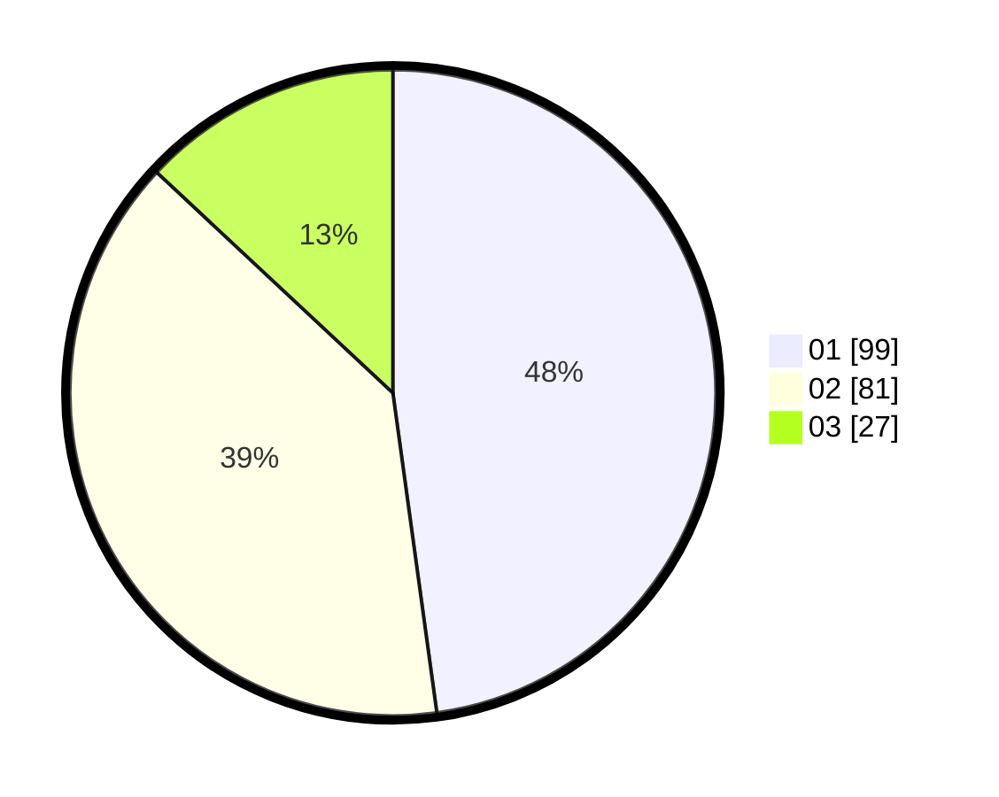

# Hasil

Hasil perolehan suara paslon dapat dilihat pada file paslon-01.txt, paslon-02.txt, dan paslon-03.txt.

Jika tidak ada, artinya data tersebut belum ada pada SIREKAP.

## Perolehan Suara

 * Paslon 01: **99**.
 * Paslon 02: **81**.
 * Paslon 03: **27**.

## Foto C Plano

https://sirekap-obj-formc.kpu.go.id/107f/pemilu/ppwp/31/73/06/10/01/3173061001003-20240216-025220--28fef542-5d33-4010-8f4c-a720823c09e9.jpg

https://sirekap-obj-formc.kpu.go.id/107f/pemilu/ppwp/31/73/06/10/01/3173061001003-20240214-184633--9bf6712d-80b4-4d3f-8e1d-5e227301001c.jpg

https://sirekap-obj-formc.kpu.go.id/107f/pemilu/ppwp/31/73/06/10/01/3173061001003-20240214-184525--1c679331-d140-4ac6-b50e-8b0d8bfea951.jpg

## DATA PEMILIH TETAP

Jumlah pemilih dalam DPT: **269**.
 * L: **127**.
 * P: **142**.

## DATA PENGGUNA HAK PILIH

Jumlah pengguna hak pilih dalam DPT: **207**.
 * L: **95**.
 * P: **112**.

Jumlah pengguna hak pilih dalam DPTb: **1**.
 * L: **1**.
 * P: **0**.

Jumlah pengguna hak pilih dalam DPK: **2**.
 * L: **1**.
 * P: **1**.

Jumlah pengguna hak pilih: **210**.
 * L: **97**.
 * P: **113**.

## JUMLAH SUARA SAH DAN TIDAK SAH

JUMLAH SELURUH SUARA SAH: **207**.

JUMLAH SUARA TIDAK SAH: **3**.

JUMLAH SELURUH SUARA SAH DAN SUARA TIDAK SAH: **210**.
