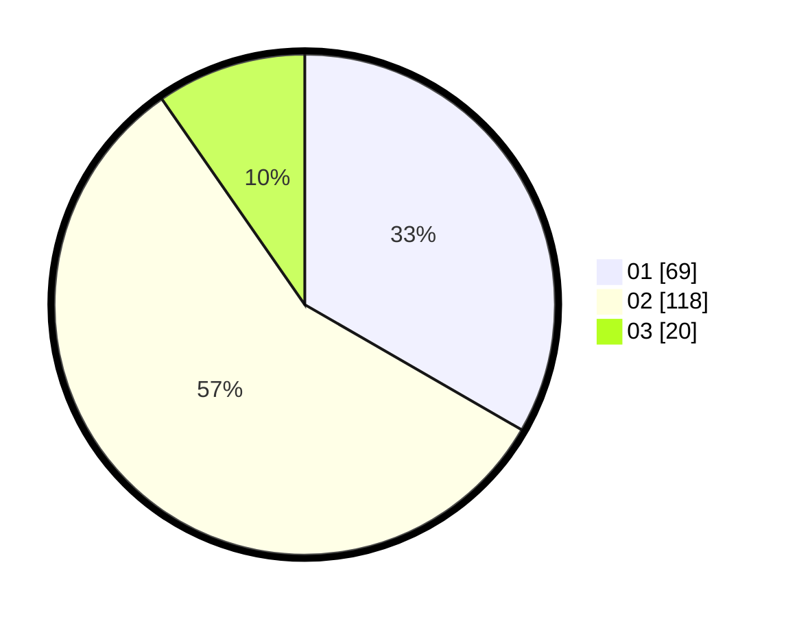

# Hasil

Hasil perolehan suara paslon dapat dilihat pada file paslon-01.txt, paslon-02.txt, dan paslon-03.txt.

Jika tidak ada, artinya data tersebut belum ada pada SIREKAP.

## Perolehan Suara

 * Paslon 01: **69**.
 * Paslon 02: **118**.
 * Paslon 03: **20**.

## Foto C Plano

https://sirekap-obj-formc.kpu.go.id/c603/pemilu/ppwp/31/73/06/10/01/3173061001008-20240214-155808--781c1ffc-85e7-46e9-aaad-fb34724cd2ee.jpg

https://sirekap-obj-formc.kpu.go.id/c603/pemilu/ppwp/31/73/06/10/01/3173061001008-20240214-214202--22bbe809-03a3-41ff-b58c-4e4971e73b3e.jpg

https://sirekap-obj-formc.kpu.go.id/c603/pemilu/ppwp/31/73/06/10/01/3173061001008-20240214-160109--c60ab165-ce59-477f-91d6-37f998a9dbd7.jpg

## DATA PEMILIH TETAP

Jumlah pemilih dalam DPT: **269**.
 * L: **142**.
 * P: **127**.

## DATA PENGGUNA HAK PILIH

Jumlah pengguna hak pilih dalam DPT: **207**.
 * L: **105**.
 * P: **102**.

Jumlah pengguna hak pilih dalam DPTb: **0**.
 * L: **0**.
 * P: **0**.

Jumlah pengguna hak pilih dalam DPK: **2**.
 * L: **2**.
 * P: **0**.

Jumlah pengguna hak pilih: **209**.
 * L: **107**.
 * P: **102**.

## JUMLAH SUARA SAH DAN TIDAK SAH

JUMLAH SELURUH SUARA SAH: **207**.

JUMLAH SUARA TIDAK SAH: **2**.

JUMLAH SELURUH SUARA SAH DAN SUARA TIDAK SAH: **209**.
