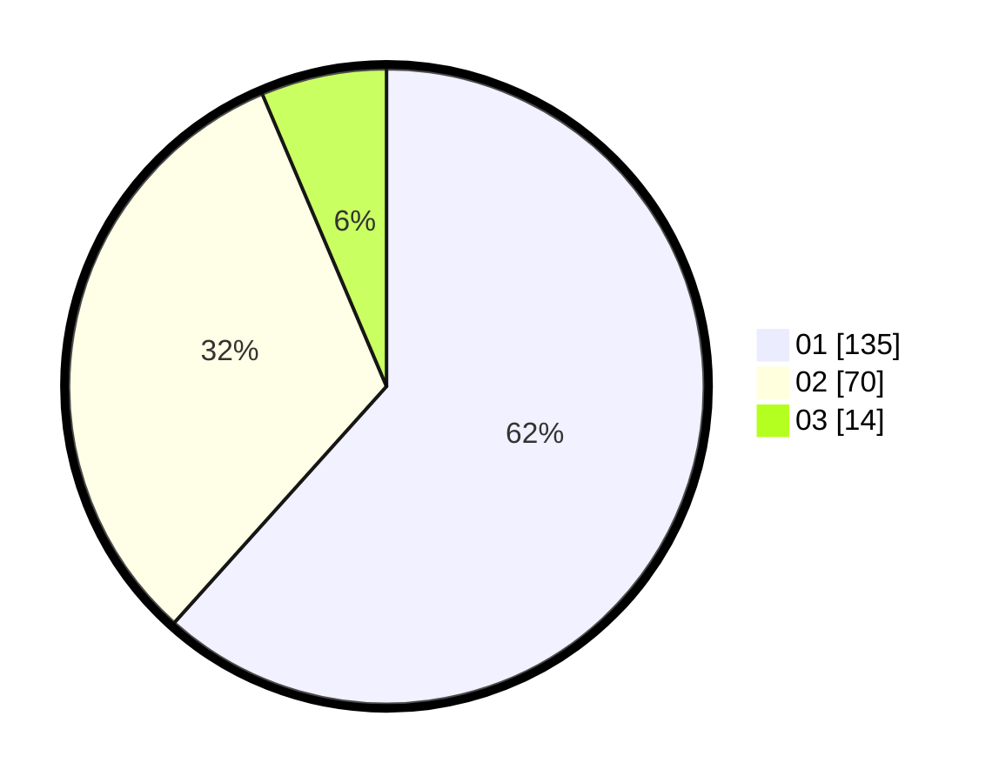

# Hasil

Hasil perolehan suara paslon dapat dilihat pada file paslon-01.txt, paslon-02.txt, dan paslon-03.txt.

Jika tidak ada, artinya data tersebut belum ada pada SIREKAP.

## Perolehan Suara

 * Paslon 01: **135**.
 * Paslon 02: **70**.
 * Paslon 03: **14**.

## Foto C Plano

https://sirekap-obj-formc.kpu.go.id/2855/pemilu/ppwp/31/73/06/10/01/3173061001010-20240215-011156--0c79ee25-ed0c-43a5-8e5b-c02c1f347b63.jpg

https://sirekap-obj-formc.kpu.go.id/2855/pemilu/ppwp/31/73/06/10/01/3173061001010-20240215-011401--8816ae98-df37-4fc2-9b80-d6b296e92f03.jpg

https://sirekap-obj-formc.kpu.go.id/2855/pemilu/ppwp/31/73/06/10/01/3173061001010-20240215-011606--cad32470-0363-43cd-adfb-ef385c4918b8.jpg
