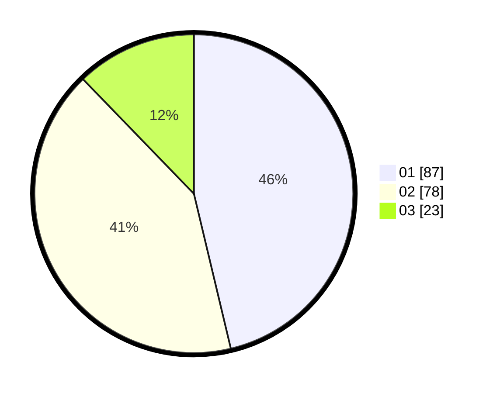

# Hasil

Hasil perolehan suara paslon dapat dilihat pada file paslon-01.txt, paslon-02.txt, dan paslon-03.txt.

Jika tidak ada, artinya data tersebut belum ada pada SIREKAP.

## Perolehan Suara

 * Paslon 01: **87**.
 * Paslon 02: **78**.
 * Paslon 03: **23**.

## Foto C Plano

https://sirekap-obj-formc.kpu.go.id/61f8/pemilu/ppwp/31/73/06/10/01/3173061001011-20240216-023336--6904e2ce-ff5e-46a5-931f-f3dec7909cbb.jpg

https://sirekap-obj-formc.kpu.go.id/61f8/pemilu/ppwp/31/73/06/10/01/3173061001011-20240216-023340--99c90d16-a086-4a8b-a122-bbc92a84ab2e.jpg

https://sirekap-obj-formc.kpu.go.id/61f8/pemilu/ppwp/31/73/06/10/01/3173061001011-20240216-023338--791f5e36-ff79-4b46-803d-fe5e5ce580ba.jpg

## DATA PEMILIH TETAP

Jumlah pemilih dalam DPT: **277**.
 * L: **143**.
 * P: **134**.

## DATA PENGGUNA HAK PILIH

Jumlah pengguna hak pilih dalam DPT: **183**.
 * L: **90**.
 * P: **93**.

Jumlah pengguna hak pilih dalam DPTb: **0**.
 * L: **0**.
 * P: **0**.

Jumlah pengguna hak pilih dalam DPK: **5**.
 * L: **2**.
 * P: **3**.

Jumlah pengguna hak pilih: **188**.
 * L: **92**.
 * P: **96**.

## JUMLAH SUARA SAH DAN TIDAK SAH

JUMLAH SELURUH SUARA SAH: **188**.

JUMLAH SUARA TIDAK SAH: **0**.

JUMLAH SELURUH SUARA SAH DAN SUARA TIDAK SAH: **188**.
