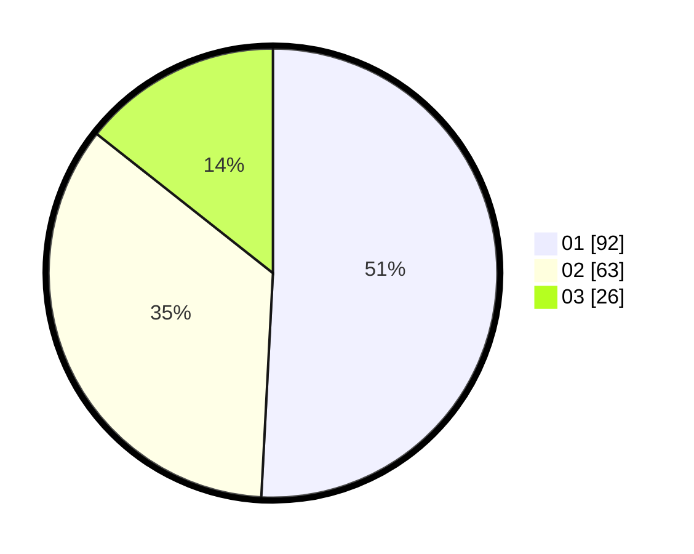

# Hasil

Hasil perolehan suara paslon dapat dilihat pada file paslon-01.txt, paslon-02.txt, dan paslon-03.txt.

Jika tidak ada, artinya data tersebut belum ada pada SIREKAP.

## Perolehan Suara

 * Paslon 01: **92**.
 * Paslon 02: **63**.
 * Paslon 03: **26**.

## Foto C Plano

https://sirekap-obj-formc.kpu.go.id/d312/pemilu/ppwp/31/73/06/10/01/3173061001012-20240214-232817--9c39f2f6-8a46-46cc-b0cf-b4dd8410772c.jpg

https://sirekap-obj-formc.kpu.go.id/d312/pemilu/ppwp/31/73/06/10/01/3173061001012-20240214-232740--896aebb7-8a61-4add-b08c-5f3a9cb73fe9.jpg

https://sirekap-obj-formc.kpu.go.id/d312/pemilu/ppwp/31/73/06/10/01/3173061001012-20240214-232902--91d024d6-98f8-4bdb-9e88-03ac3fc98063.jpg

## DATA PEMILIH TETAP

Jumlah pemilih dalam DPT: **233**.
 * L: **114**.
 * P: **119**.

## DATA PENGGUNA HAK PILIH

Jumlah pengguna hak pilih dalam DPT: **176**.
 * L: **82**.
 * P: **94**.

Jumlah pengguna hak pilih dalam DPTb: **6**.
 * L: **1**.
 * P: **5**.

Jumlah pengguna hak pilih dalam DPK: **1**.
 * L: **0**.
 * P: **1**.

Jumlah pengguna hak pilih: **183**.
 * L: **83**.
 * P: **100**.

## JUMLAH SUARA SAH DAN TIDAK SAH

JUMLAH SELURUH SUARA SAH: **181**.

JUMLAH SUARA TIDAK SAH: **2**.

JUMLAH SELURUH SUARA SAH DAN SUARA TIDAK SAH: **183**.
