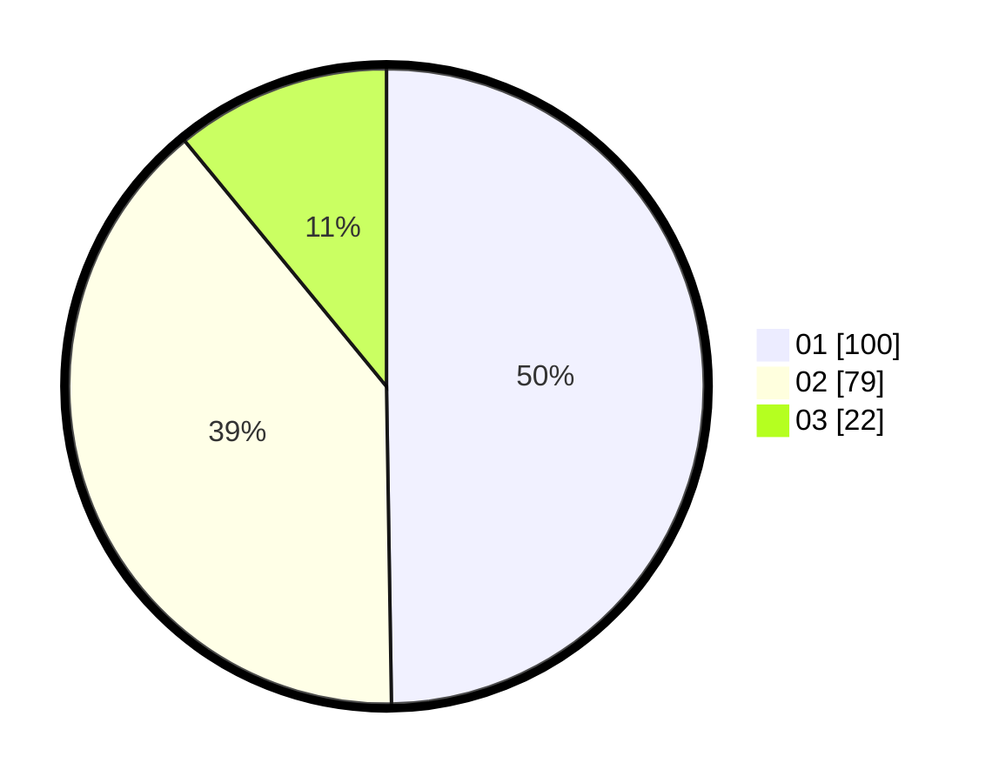

# Hasil

Hasil perolehan suara paslon dapat dilihat pada file paslon-01.txt, paslon-02.txt, dan paslon-03.txt.

Jika tidak ada, artinya data tersebut belum ada pada SIREKAP.

## Perolehan Suara

 * Paslon 01: **100**.
 * Paslon 02: **79**.
 * Paslon 03: **22**.

## Foto C Plano

https://sirekap-obj-formc.kpu.go.id/b95b/pemilu/ppwp/31/73/06/10/01/3173061001014-20240214-223847--c2d76711-596c-45bb-bf7b-6f5843a9d465.jpg

https://sirekap-obj-formc.kpu.go.id/b95b/pemilu/ppwp/31/73/06/10/01/3173061001014-20240214-193013--5225c6eb-9450-4f98-a1dd-b9ee8e16308a.jpg

https://sirekap-obj-formc.kpu.go.id/b95b/pemilu/ppwp/31/73/06/10/01/3173061001014-20240214-222918--07b70b05-119b-4132-9fee-068e355a2f00.jpg
