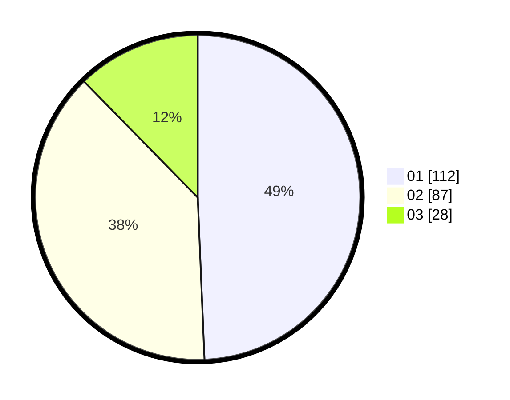

# Hasil

Hasil perolehan suara paslon dapat dilihat pada file paslon-01.txt, paslon-02.txt, dan paslon-03.txt.

Jika tidak ada, artinya data tersebut belum ada pada SIREKAP.

## Perolehan Suara

 * Paslon 01: **112**.
 * Paslon 02: **87**.
 * Paslon 03: **28**.

## Foto C Plano

https://sirekap-obj-formc.kpu.go.id/bcd5/pemilu/ppwp/31/73/06/10/01/3173061001020-20240214-234915--130e52e6-5ebc-41c5-a768-45c731ee073c.jpg

https://sirekap-obj-formc.kpu.go.id/bcd5/pemilu/ppwp/31/73/06/10/01/3173061001020-20240214-235041--203e63e1-9bfc-474a-909b-2b1d28c37f80.jpg

https://sirekap-obj-formc.kpu.go.id/bcd5/pemilu/ppwp/31/73/06/10/01/3173061001020-20240214-235140--95336f7b-c43f-4a2a-8604-6e858052b64d.jpg
