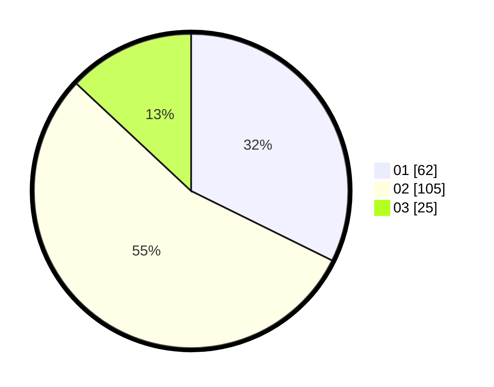

# Hasil

Hasil perolehan suara paslon dapat dilihat pada file paslon-01.txt, paslon-02.txt, dan paslon-03.txt.

Jika tidak ada, artinya data tersebut belum ada pada SIREKAP.

## Perolehan Suara

 * Paslon 01: **62**.
 * Paslon 02: **105**.
 * Paslon 03: **25**.

## Foto C Plano

https://sirekap-obj-formc.kpu.go.id/0abc/pemilu/ppwp/31/73/06/10/01/3173061001022-20240214-155108--8e278aad-4822-4656-b262-c485e424df70.jpg

https://sirekap-obj-formc.kpu.go.id/0abc/pemilu/ppwp/31/73/06/10/01/3173061001022-20240214-155343--1cec6b0d-5255-469f-8703-cd1dac380ec4.jpg

https://sirekap-obj-formc.kpu.go.id/0abc/pemilu/ppwp/31/73/06/10/01/3173061001022-20240214-155244--f384710d-2ab4-4721-a846-6d6e0b07867b.jpg
