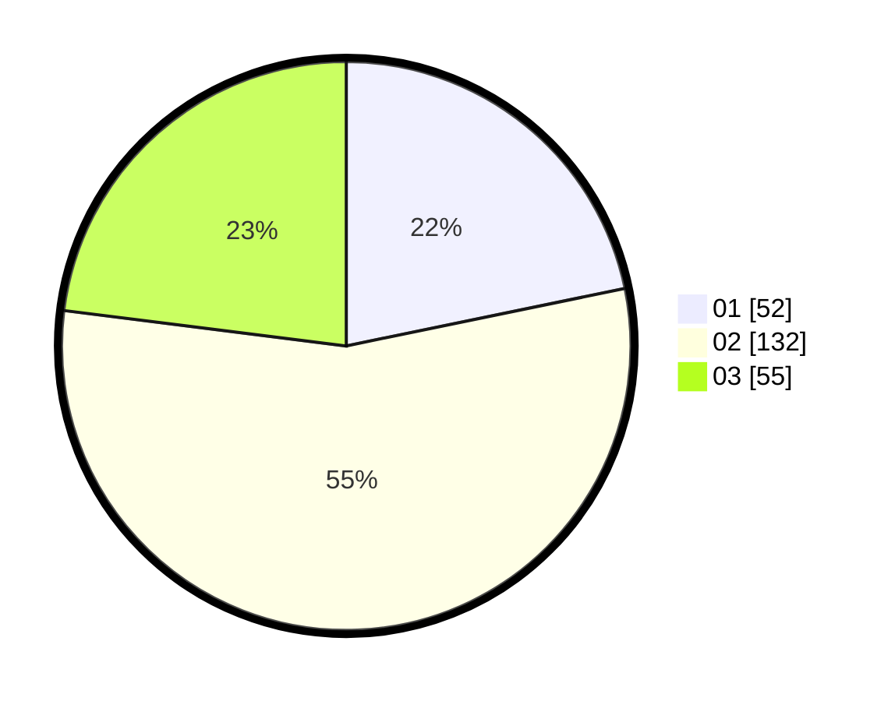

# Hasil

Hasil perolehan suara paslon dapat dilihat pada file paslon-01.txt, paslon-02.txt, dan paslon-03.txt.

Jika tidak ada, artinya data tersebut belum ada pada SIREKAP.

## Perolehan Suara

 * Paslon 01: **52**.
 * Paslon 02: **132**.
 * Paslon 03: **55**.

## Foto C Plano

https://sirekap-obj-formc.kpu.go.id/32a3/pemilu/ppwp/31/73/06/10/01/3173061001031-20240216-020736--bd879eed-fc4e-4dd0-ae9f-3f3078b4b630.jpg

https://sirekap-obj-formc.kpu.go.id/32a3/pemilu/ppwp/31/73/06/10/01/3173061001031-20240216-020738--7a4fb164-6d07-4aa0-9fe3-89c841284554.jpg

https://sirekap-obj-formc.kpu.go.id/32a3/pemilu/ppwp/31/73/06/10/01/3173061001031-20240216-020737--93db2859-bda4-4421-999f-6e834cbc13c1.jpg

## DATA PEMILIH TETAP

Jumlah pemilih dalam DPT: **282**.
 * L: **93**.
 * P: **189**.

## DATA PENGGUNA HAK PILIH

Jumlah pengguna hak pilih dalam DPT: **235**.
 * L: **70**.
 * P: **165**.

Jumlah pengguna hak pilih dalam DPTb: **4**.
 * L: **0**.
 * P: **4**.

Jumlah pengguna hak pilih dalam DPK: **1**.
 * L: **0**.
 * P: **1**.

Jumlah pengguna hak pilih: **240**.
 * L: **70**.
 * P: **170**.

## JUMLAH SUARA SAH DAN TIDAK SAH

JUMLAH SELURUH SUARA SAH: **239**.

JUMLAH SUARA TIDAK SAH: **1**.

JUMLAH SELURUH SUARA SAH DAN SUARA TIDAK SAH: **240**.
