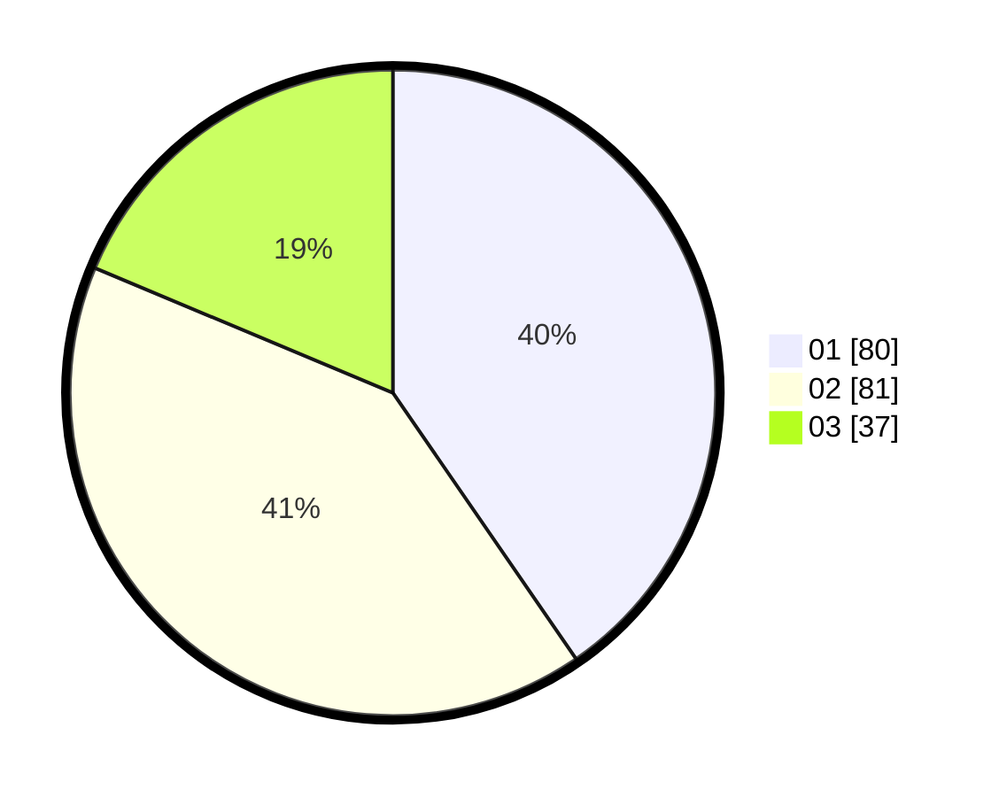

# Hasil

Hasil perolehan suara paslon dapat dilihat pada file paslon-01.txt, paslon-02.txt, dan paslon-03.txt.

Jika tidak ada, artinya data tersebut belum ada pada SIREKAP.

## Perolehan Suara

 * Paslon 01: **80**.
 * Paslon 02: **81**.
 * Paslon 03: **37**.

## Foto C Plano

https://sirekap-obj-formc.kpu.go.id/62f0/pemilu/ppwp/31/73/06/10/01/3173061001038-20240215-151652--81776fdc-7cd8-4259-96a8-d33d7e0a9636.jpg

https://sirekap-obj-formc.kpu.go.id/62f0/pemilu/ppwp/31/73/06/10/01/3173061001038-20240215-151713--c1df00c0-3f4c-4556-babf-f835cfd20f74.jpg

https://sirekap-obj-formc.kpu.go.id/62f0/pemilu/ppwp/31/73/06/10/01/3173061001038-20240215-151703--54636125-6d88-4fb6-b4e7-fa2ab4070a0f.jpg

## DATA PEMILIH TETAP

Jumlah pemilih dalam DPT: **270**.
 * L: **143**.
 * P: **127**.

## DATA PENGGUNA HAK PILIH

Jumlah pengguna hak pilih dalam DPT: **198**.
 * L: **102**.
 * P: **96**.

Jumlah pengguna hak pilih dalam DPTb: **3**.
 * L: **0**.
 * P: **3**.

Jumlah pengguna hak pilih dalam DPK: **0**.
 * L: **0**.
 * P: **0**.

Jumlah pengguna hak pilih: **201**.
 * L: **102**.
 * P: **99**.

## JUMLAH SUARA SAH DAN TIDAK SAH

JUMLAH SELURUH SUARA SAH: **198**.

JUMLAH SUARA TIDAK SAH: **3**.

JUMLAH SELURUH SUARA SAH DAN SUARA TIDAK SAH: **201**.
