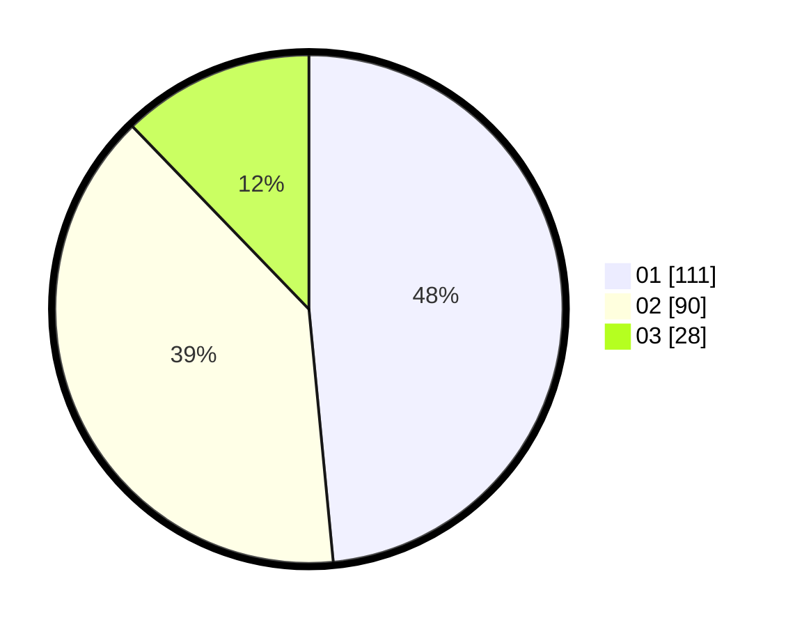

# Hasil

Hasil perolehan suara paslon dapat dilihat pada file paslon-01.txt, paslon-02.txt, dan paslon-03.txt.

Jika tidak ada, artinya data tersebut belum ada pada SIREKAP.

## Perolehan Suara

 * Paslon 01: **111**.
 * Paslon 02: **90**.
 * Paslon 03: **28**.

## Foto C Plano

https://sirekap-obj-formc.kpu.go.id/c5b1/pemilu/ppwp/31/73/06/10/01/3173061001039-20240214-192914--a08408d8-24a3-4d36-bf66-a0ce83cb6a7f.jpg

https://sirekap-obj-formc.kpu.go.id/c5b1/pemilu/ppwp/31/73/06/10/01/3173061001039-20240214-193311--817ca0d7-8a33-4e04-922b-15fc0ec744fe.jpg

https://sirekap-obj-formc.kpu.go.id/c5b1/pemilu/ppwp/31/73/06/10/01/3173061001039-20240214-193502--a8471cb4-abbd-4c70-b515-8a88f080dbb1.jpg

## DATA PEMILIH TETAP

Jumlah pemilih dalam DPT: **281**.
 * L: **142**.
 * P: **139**.

## DATA PENGGUNA HAK PILIH

Jumlah pengguna hak pilih dalam DPT: **230**.
 * L: **112**.
 * P: **118**.

Jumlah pengguna hak pilih dalam DPTb: **0**.
 * L: **0**.
 * P: **0**.

Jumlah pengguna hak pilih dalam DPK: **0**.
 * L: **0**.
 * P: **0**.

Jumlah pengguna hak pilih: **230**.
 * L: **112**.
 * P: **118**.

## JUMLAH SUARA SAH DAN TIDAK SAH

JUMLAH SELURUH SUARA SAH: **229**.

JUMLAH SUARA TIDAK SAH: **1**.

JUMLAH SELURUH SUARA SAH DAN SUARA TIDAK SAH: **230**.
