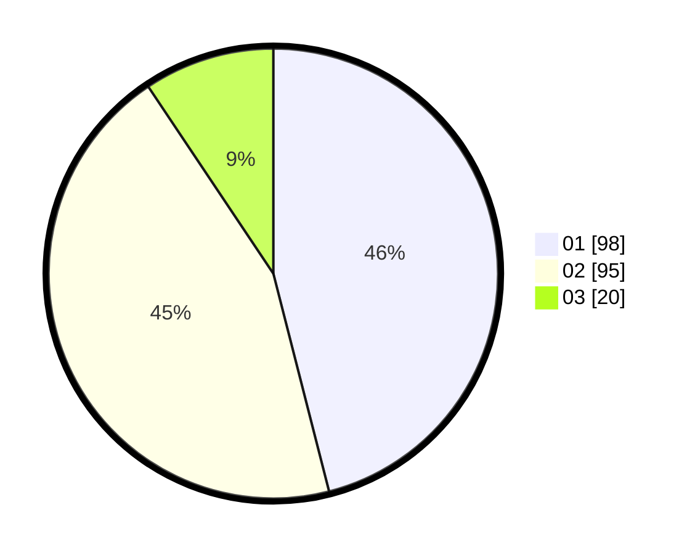

# Hasil

Hasil perolehan suara paslon dapat dilihat pada file paslon-01.txt, paslon-02.txt, dan paslon-03.txt.

Jika tidak ada, artinya data tersebut belum ada pada SIREKAP.

## Perolehan Suara

 * Paslon 01: **98**.
 * Paslon 02: **95**.
 * Paslon 03: **20**.

## Foto C Plano

https://sirekap-obj-formc.kpu.go.id/4bbb/pemilu/ppwp/31/73/06/10/01/3173061001043-20240215-012000--80f4b1af-7a66-4312-bacd-dcb2fc950219.jpg

https://sirekap-obj-formc.kpu.go.id/4bbb/pemilu/ppwp/31/73/06/10/01/3173061001043-20240215-023209--99851658-648c-4f11-9560-ff1e01723c26.jpg

https://sirekap-obj-formc.kpu.go.id/4bbb/pemilu/ppwp/31/73/06/10/01/3173061001043-20240215-022734--9520cf4d-ea01-4f83-bfdd-d209652316c3.jpg
