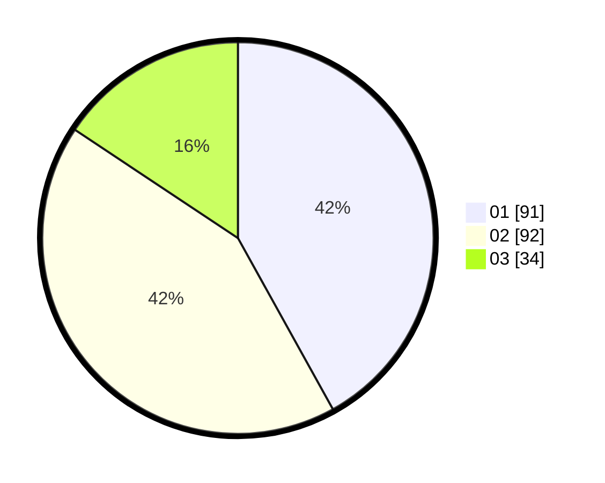

# Hasil

Hasil perolehan suara paslon dapat dilihat pada file paslon-01.txt, paslon-02.txt, dan paslon-03.txt.

Jika tidak ada, artinya data tersebut belum ada pada SIREKAP.

## Perolehan Suara

 * Paslon 01: **91**.
 * Paslon 02: **92**.
 * Paslon 03: **34**.

## Foto C Plano

https://sirekap-obj-formc.kpu.go.id/60cc/pemilu/ppwp/31/73/06/10/01/3173061001044-20240214-211416--5a7d552a-ad1a-4fea-bba9-9bd0284c0bae.jpg

https://sirekap-obj-formc.kpu.go.id/60cc/pemilu/ppwp/31/73/06/10/01/3173061001044-20240214-211658--5cb6750a-135d-42ba-bfe4-64aa4e407e2c.jpg

https://sirekap-obj-formc.kpu.go.id/60cc/pemilu/ppwp/31/73/06/10/01/3173061001044-20240214-211913--5594d191-34aa-42ac-8515-762cb5d51d53.jpg

## DATA PEMILIH TETAP

Jumlah pemilih dalam DPT: **280**.
 * L: **148**.
 * P: **132**.

## DATA PENGGUNA HAK PILIH

Jumlah pengguna hak pilih dalam DPT: **217**.
 * L: **110**.
 * P: **107**.

Jumlah pengguna hak pilih dalam DPTb: **0**.
 * L: **0**.
 * P: **0**.

Jumlah pengguna hak pilih dalam DPK: **2**.
 * L: **1**.
 * P: **1**.

Jumlah pengguna hak pilih: **219**.
 * L: **111**.
 * P: **108**.

## JUMLAH SUARA SAH DAN TIDAK SAH

JUMLAH SELURUH SUARA SAH: **217**.

JUMLAH SUARA TIDAK SAH: **2**.

JUMLAH SELURUH SUARA SAH DAN SUARA TIDAK SAH: **219**.
