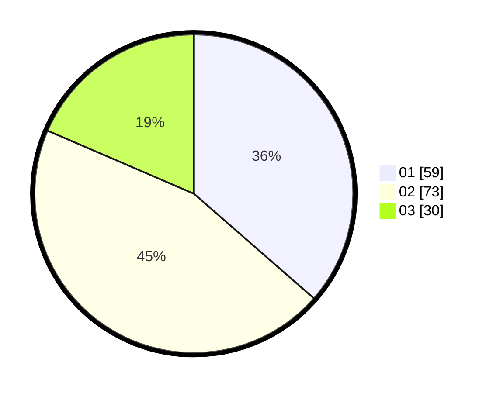

# Hasil

Hasil perolehan suara paslon dapat dilihat pada file paslon-01.txt, paslon-02.txt, dan paslon-03.txt.

Jika tidak ada, artinya data tersebut belum ada pada SIREKAP.

## Perolehan Suara

 * Paslon 01: **59**.
 * Paslon 02: **73**.
 * Paslon 03: **30**.

## Foto C Plano

https://sirekap-obj-formc.kpu.go.id/e100/pemilu/ppwp/31/73/06/10/01/3173061001046-20240215-235430--badc8d6b-ef09-41d7-ae30-773f5a3f18dd.jpg

https://sirekap-obj-formc.kpu.go.id/e100/pemilu/ppwp/31/73/06/10/01/3173061001046-20240215-235434--7ebaa147-8a2c-4b40-ba67-7152f25a35ab.jpg

https://sirekap-obj-formc.kpu.go.id/e100/pemilu/ppwp/31/73/06/10/01/3173061001046-20240215-235432--3c957762-5cbe-405b-85e7-1a39388f9c4f.jpg

## DATA PEMILIH TETAP

Jumlah pemilih dalam DPT: **194**.
 * L: **94**.
 * P: **100**.

## DATA PENGGUNA HAK PILIH

Jumlah pengguna hak pilih dalam DPT: **159**.
 * L: **76**.
 * P: **83**.

Jumlah pengguna hak pilih dalam DPTb: **0**.
 * L: **0**.
 * P: **0**.

Jumlah pengguna hak pilih dalam DPK: **4**.
 * L: **2**.
 * P: **2**.

Jumlah pengguna hak pilih: **163**.
 * L: **78**.
 * P: **85**.

## JUMLAH SUARA SAH DAN TIDAK SAH

JUMLAH SELURUH SUARA SAH: **162**.

JUMLAH SUARA TIDAK SAH: **1**.

JUMLAH SELURUH SUARA SAH DAN SUARA TIDAK SAH: **163**.
