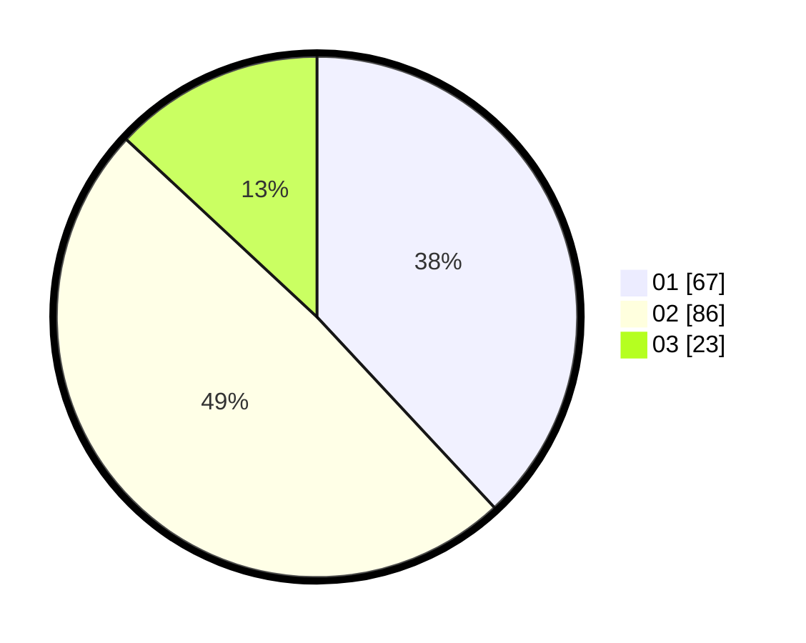

# Hasil

Hasil perolehan suara paslon dapat dilihat pada file paslon-01.txt, paslon-02.txt, dan paslon-03.txt.

Jika tidak ada, artinya data tersebut belum ada pada SIREKAP.

## Perolehan Suara

 * Paslon 01: **67**.
 * Paslon 02: **86**.
 * Paslon 03: **23**.

## Foto C Plano

https://sirekap-obj-formc.kpu.go.id/2860/pemilu/ppwp/31/73/06/10/01/3173061001047-20240214-184527--4db05a4a-4259-44ed-b0bc-7ac451c16562.jpg

https://sirekap-obj-formc.kpu.go.id/2860/pemilu/ppwp/31/73/06/10/01/3173061001047-20240214-184544--bb8bdb6e-11db-4173-a140-536f45bb68ea.jpg

https://sirekap-obj-formc.kpu.go.id/2860/pemilu/ppwp/31/73/06/10/01/3173061001047-20240214-184710--496fec52-b67b-4e29-a411-812057aa11e2.jpg

## DATA PEMILIH TETAP

Jumlah pemilih dalam DPT: **212**.
 * L: **104**.
 * P: **108**.

## DATA PENGGUNA HAK PILIH

Jumlah pengguna hak pilih dalam DPT: **163**.
 * L: **76**.
 * P: **87**.

Jumlah pengguna hak pilih dalam DPTb: **6**.
 * L: **3**.
 * P: **3**.

Jumlah pengguna hak pilih dalam DPK: **8**.
 * L: **4**.
 * P: **4**.

Jumlah pengguna hak pilih: **177**.
 * L: **83**.
 * P: **94**.

## JUMLAH SUARA SAH DAN TIDAK SAH

JUMLAH SELURUH SUARA SAH: **176**.

JUMLAH SUARA TIDAK SAH: **1**.

JUMLAH SELURUH SUARA SAH DAN SUARA TIDAK SAH: **177**.
