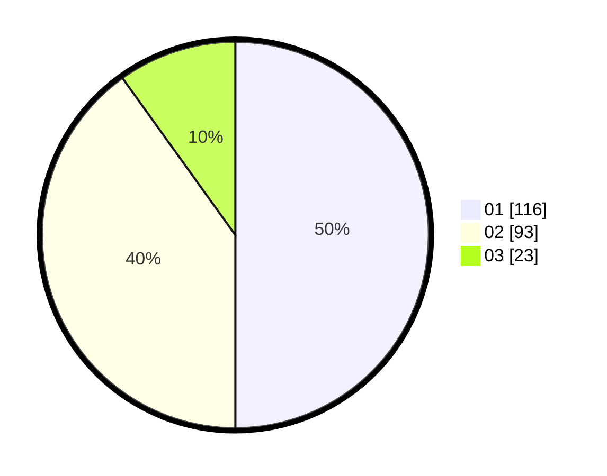

# Hasil

Hasil perolehan suara paslon dapat dilihat pada file paslon-01.txt, paslon-02.txt, dan paslon-03.txt.

Jika tidak ada, artinya data tersebut belum ada pada SIREKAP.

## Perolehan Suara

 * Paslon 01: **116**.
 * Paslon 02: **93**.
 * Paslon 03: **23**.

## Foto C Plano

https://sirekap-obj-formc.kpu.go.id/4e61/pemilu/ppwp/31/73/06/10/01/3173061001050-20240214-190734--9cd85ddd-5e9a-4695-a751-8d82c2eea63a.jpg

https://sirekap-obj-formc.kpu.go.id/4e61/pemilu/ppwp/31/73/06/10/01/3173061001050-20240214-193321--e428bc6c-9904-42b2-a918-0278ebc4a87e.jpg

https://sirekap-obj-formc.kpu.go.id/4e61/pemilu/ppwp/31/73/06/10/01/3173061001050-20240214-193405--e7a51d93-54f9-4467-977e-acae43db3e49.jpg

## DATA PEMILIH TETAP

Jumlah pemilih dalam DPT: **298**.
 * L: **150**.
 * P: **148**.

## DATA PENGGUNA HAK PILIH

Jumlah pengguna hak pilih dalam DPT: **231**.
 * L: **112**.
 * P: **119**.

Jumlah pengguna hak pilih dalam DPTb: **1**.
 * L: **0**.
 * P: **1**.

Jumlah pengguna hak pilih dalam DPK: **3**.
 * L: **3**.
 * P: **0**.

Jumlah pengguna hak pilih: **235**.
 * L: **115**.
 * P: **120**.

## JUMLAH SUARA SAH DAN TIDAK SAH

JUMLAH SELURUH SUARA SAH: **232**.

JUMLAH SUARA TIDAK SAH: **3**.

JUMLAH SELURUH SUARA SAH DAN SUARA TIDAK SAH: **235**.
