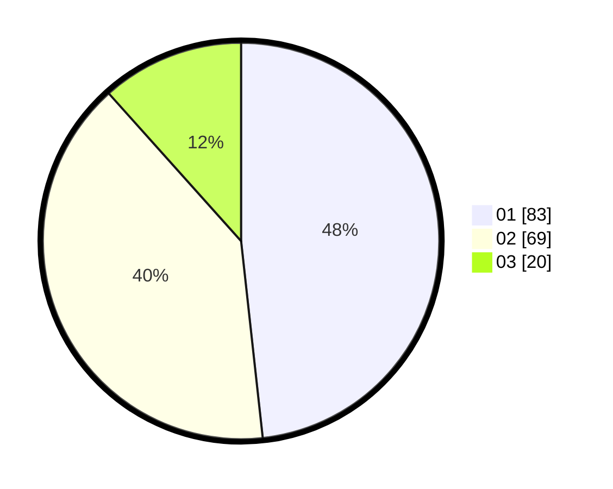

# Hasil

Hasil perolehan suara paslon dapat dilihat pada file paslon-01.txt, paslon-02.txt, dan paslon-03.txt.

Jika tidak ada, artinya data tersebut belum ada pada SIREKAP.

## Perolehan Suara

 * Paslon 01: **83**.
 * Paslon 02: **69**.
 * Paslon 03: **20**.

## Foto C Plano

https://sirekap-obj-formc.kpu.go.id/9560/pemilu/ppwp/31/73/06/10/01/3173061001052-20240214-192055--ff40534f-2f34-4bc3-bcf1-1214050bbc17.jpg

https://sirekap-obj-formc.kpu.go.id/9560/pemilu/ppwp/31/73/06/10/01/3173061001052-20240214-200508--b6229157-df3e-4012-98a4-d31250846a3a.jpg

https://sirekap-obj-formc.kpu.go.id/9560/pemilu/ppwp/31/73/06/10/01/3173061001052-20240214-191919--174a682f-ede2-4558-97a0-1e666cd45e1f.jpg

## DATA PEMILIH TETAP

Jumlah pemilih dalam DPT: **208**.
 * L: **110**.
 * P: **98**.

## DATA PENGGUNA HAK PILIH

Jumlah pengguna hak pilih dalam DPT: **169**.
 * L: **85**.
 * P: **84**.

Jumlah pengguna hak pilih dalam DPTb: **4**.
 * L: **2**.
 * P: **2**.

Jumlah pengguna hak pilih dalam DPK: **1**.
 * L: **1**.
 * P: **0**.

Jumlah pengguna hak pilih: **174**.
 * L: **88**.
 * P: **86**.

## JUMLAH SUARA SAH DAN TIDAK SAH

JUMLAH SELURUH SUARA SAH: **172**.

JUMLAH SUARA TIDAK SAH: **2**.

JUMLAH SELURUH SUARA SAH DAN SUARA TIDAK SAH: **174**.
