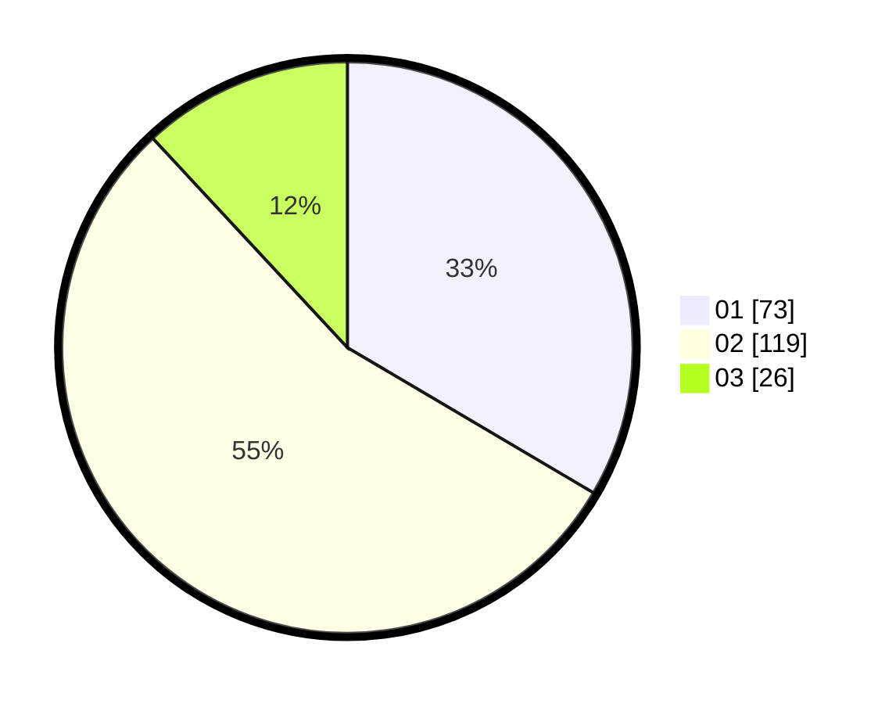

# Hasil

Hasil perolehan suara paslon dapat dilihat pada file paslon-01.txt, paslon-02.txt, dan paslon-03.txt.

Jika tidak ada, artinya data tersebut belum ada pada SIREKAP.

## Perolehan Suara

 * Paslon 01: **73**.
 * Paslon 02: **119**.
 * Paslon 03: **26**.

## Foto C Plano

https://sirekap-obj-formc.kpu.go.id/2c41/pemilu/ppwp/31/73/06/10/01/3173061001059-20240216-080413--03d50d12-faab-47e7-b766-5dca17c66705.jpg

https://sirekap-obj-formc.kpu.go.id/2c41/pemilu/ppwp/31/73/06/10/01/3173061001059-20240216-080414--a61031ee-f574-4bf7-a4cb-bdd1eb3def0d.jpg

https://sirekap-obj-formc.kpu.go.id/2c41/pemilu/ppwp/31/73/06/10/01/3173061001059-20240216-080414--9adaa2b5-610c-4147-b482-7daf2abf3a78.jpg

## DATA PEMILIH TETAP

Jumlah pemilih dalam DPT: **274**.
 * L: **127**.
 * P: **147**.

## DATA PENGGUNA HAK PILIH

Jumlah pengguna hak pilih dalam DPT: **219**.
 * L: **100**.
 * P: **119**.

Jumlah pengguna hak pilih dalam DPTb: **1**.
 * L: **1**.
 * P: **0**.

Jumlah pengguna hak pilih dalam DPK: **2**.
 * L: **1**.
 * P: **1**.

Jumlah pengguna hak pilih: **222**.
 * L: **102**.
 * P: **120**.

## JUMLAH SUARA SAH DAN TIDAK SAH

JUMLAH SELURUH SUARA SAH: **218**.

JUMLAH SUARA TIDAK SAH: **4**.

JUMLAH SELURUH SUARA SAH DAN SUARA TIDAK SAH: **222**.
