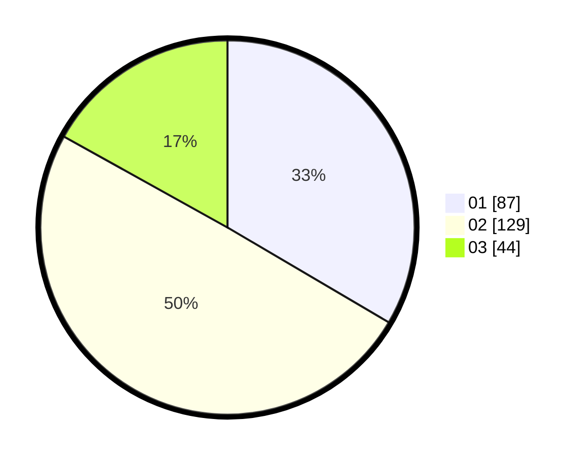

# Hasil

Hasil perolehan suara paslon dapat dilihat pada file paslon-01.txt, paslon-02.txt, dan paslon-03.txt.

Jika tidak ada, artinya data tersebut belum ada pada SIREKAP.

## Perolehan Suara

 * Paslon 01: **87**.
 * Paslon 02: **129**.
 * Paslon 03: **44**.

## Foto C Plano

https://sirekap-obj-formc.kpu.go.id/b05f/pemilu/ppwp/31/73/06/10/01/3173061001060-20240215-095415--3e2b1d99-28dd-4f0e-95d1-e31252a1d292.jpg

https://sirekap-obj-formc.kpu.go.id/b05f/pemilu/ppwp/31/73/06/10/01/3173061001060-20240215-095501--c3d46911-6b4e-47d4-951c-0f9a4ef8ca15.jpg

https://sirekap-obj-formc.kpu.go.id/b05f/pemilu/ppwp/31/73/06/10/01/3173061001060-20240215-095633--364f8cef-bead-46ea-94db-aa5737d7a01d.jpg
