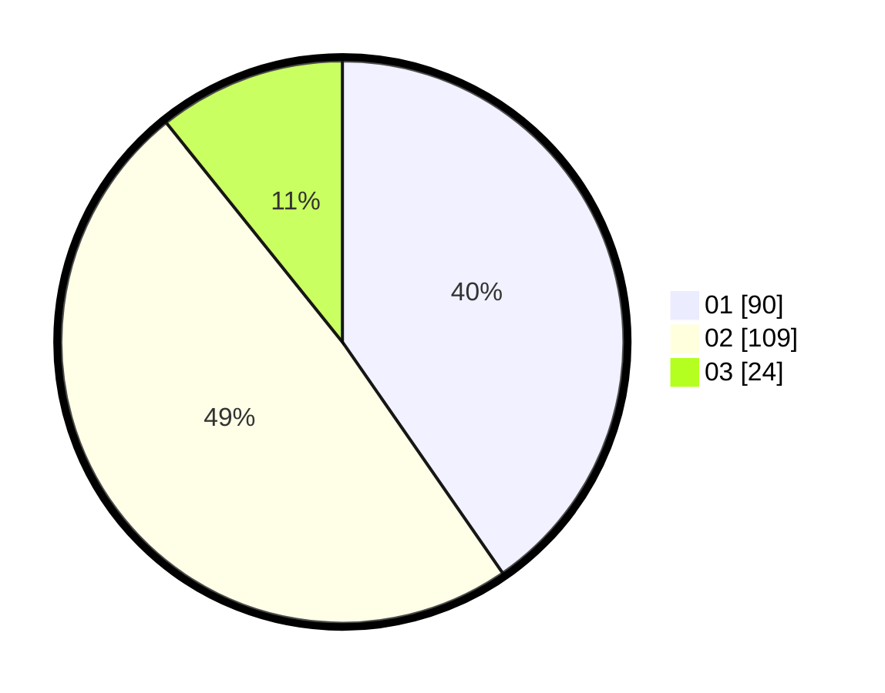

# Hasil

Hasil perolehan suara paslon dapat dilihat pada file paslon-01.txt, paslon-02.txt, dan paslon-03.txt.

Jika tidak ada, artinya data tersebut belum ada pada SIREKAP.

## Perolehan Suara

 * Paslon 01: **90**.
 * Paslon 02: **109**.
 * Paslon 03: **24**.

## Foto C Plano

https://sirekap-obj-formc.kpu.go.id/d12d/pemilu/ppwp/31/73/06/10/01/3173061001061-20240214-204305--8f347603-2d4e-4359-bee2-19aac628c813.jpg

https://sirekap-obj-formc.kpu.go.id/d12d/pemilu/ppwp/31/73/06/10/01/3173061001061-20240214-204513--c0de5221-3cda-4676-a650-3996dceeb5e0.jpg

https://sirekap-obj-formc.kpu.go.id/d12d/pemilu/ppwp/31/73/06/10/01/3173061001061-20240214-204555--d11748e8-4cce-4b4f-8b82-303d78629c3a.jpg

## DATA PEMILIH TETAP

Jumlah pemilih dalam DPT: **293**.
 * L: **147**.
 * P: **146**.

## DATA PENGGUNA HAK PILIH

Jumlah pengguna hak pilih dalam DPT: **224**.
 * L: **110**.
 * P: **114**.

Jumlah pengguna hak pilih dalam DPTb: **0**.
 * L: **0**.
 * P: **0**.

Jumlah pengguna hak pilih dalam DPK: **1**.
 * L: **1**.
 * P: **0**.

Jumlah pengguna hak pilih: **225**.
 * L: **111**.
 * P: **114**.

## JUMLAH SUARA SAH DAN TIDAK SAH

JUMLAH SELURUH SUARA SAH: **223**.

JUMLAH SUARA TIDAK SAH: **2**.

JUMLAH SELURUH SUARA SAH DAN SUARA TIDAK SAH: **225**.
