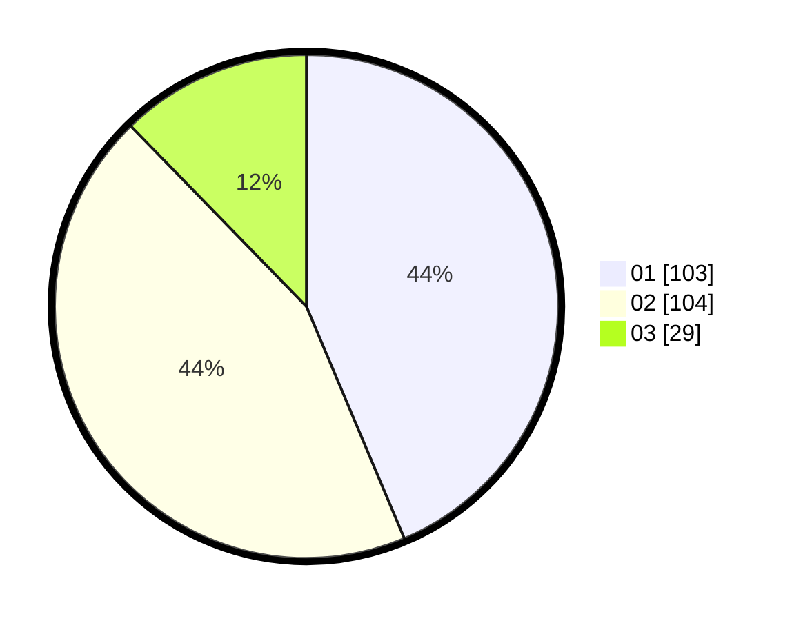

# Hasil

Hasil perolehan suara paslon dapat dilihat pada file paslon-01.txt, paslon-02.txt, dan paslon-03.txt.

Jika tidak ada, artinya data tersebut belum ada pada SIREKAP.

## Perolehan Suara

 * Paslon 01: **103**.
 * Paslon 02: **104**.
 * Paslon 03: **29**.

## Foto C Plano

https://sirekap-obj-formc.kpu.go.id/7155/pemilu/ppwp/31/73/06/10/01/3173061001063-20240216-000355--c0a7fc30-bfd5-4f46-9aea-b3078a0a664e.jpg

https://sirekap-obj-formc.kpu.go.id/7155/pemilu/ppwp/31/73/06/10/01/3173061001063-20240216-000356--ab55f33e-ce56-4307-9989-d7576751aa72.jpg

https://sirekap-obj-formc.kpu.go.id/7155/pemilu/ppwp/31/73/06/10/01/3173061001063-20240214-155552--25465fb4-ea38-486e-b8c0-80cfa9a63745.jpg

## DATA PEMILIH TETAP

Jumlah pemilih dalam DPT: **298**.
 * L: **145**.
 * P: **153**.

## DATA PENGGUNA HAK PILIH

Jumlah pengguna hak pilih dalam DPT: **228**.
 * L: **101**.
 * P: **127**.

Jumlah pengguna hak pilih dalam DPTb: **8**.
 * L: **4**.
 * P: **4**.

Jumlah pengguna hak pilih dalam DPK: **2**.
 * L: **1**.
 * P: **1**.

Jumlah pengguna hak pilih: **238**.
 * L: **106**.
 * P: **132**.

## JUMLAH SUARA SAH DAN TIDAK SAH

JUMLAH SELURUH SUARA SAH: **236**.

JUMLAH SUARA TIDAK SAH: **2**.

JUMLAH SELURUH SUARA SAH DAN SUARA TIDAK SAH: **238**.
