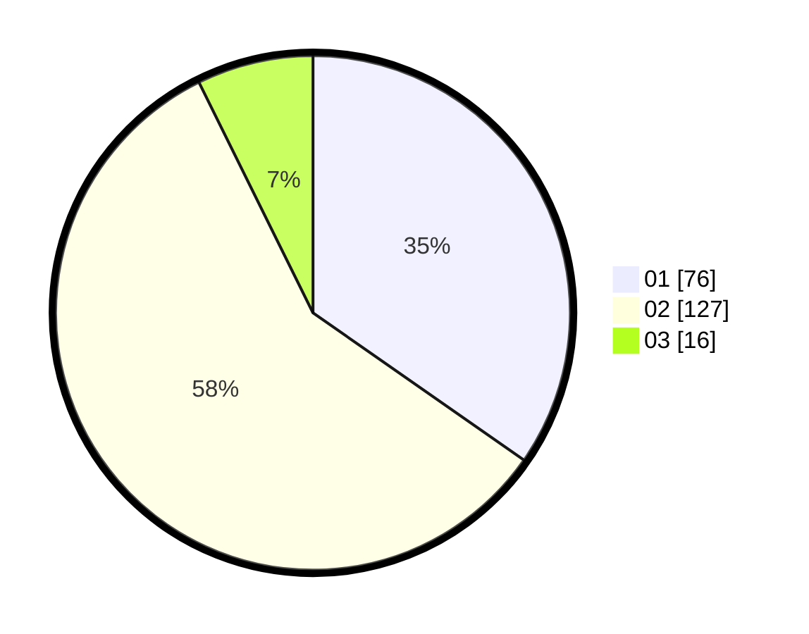

# Hasil

Hasil perolehan suara paslon dapat dilihat pada file paslon-01.txt, paslon-02.txt, dan paslon-03.txt.

Jika tidak ada, artinya data tersebut belum ada pada SIREKAP.

## Perolehan Suara

 * Paslon 01: **76**.
 * Paslon 02: **127**.
 * Paslon 03: **16**.

## Foto C Plano

https://sirekap-obj-formc.kpu.go.id/3c71/pemilu/ppwp/31/73/06/10/01/3173061001068-20240216-044425--3272f146-2046-4883-8b5c-0efd8a0e6c82.jpg

https://sirekap-obj-formc.kpu.go.id/3c71/pemilu/ppwp/31/73/06/10/01/3173061001068-20240216-044428--35893f99-1b45-4494-9286-bfcc7eb9b364.jpg

https://sirekap-obj-formc.kpu.go.id/3c71/pemilu/ppwp/31/73/06/10/01/3173061001068-20240216-044426--d13b2f77-549b-4f57-a98a-13195cccf45e.jpg

## DATA PEMILIH TETAP

Jumlah pemilih dalam DPT: **298**.
 * L: **159**.
 * P: **139**.

## DATA PENGGUNA HAK PILIH

Jumlah pengguna hak pilih dalam DPT: **224**.
 * L: **113**.
 * P: **111**.

Jumlah pengguna hak pilih dalam DPTb: **2**.
 * L: **1**.
 * P: **1**.

Jumlah pengguna hak pilih dalam DPK: **0**.
 * L: **0**.
 * P: **0**.

Jumlah pengguna hak pilih: **226**.
 * L: **114**.
 * P: **112**.

## JUMLAH SUARA SAH DAN TIDAK SAH

JUMLAH SELURUH SUARA SAH: **219**.

JUMLAH SUARA TIDAK SAH: **7**.

JUMLAH SELURUH SUARA SAH DAN SUARA TIDAK SAH: **226**.
