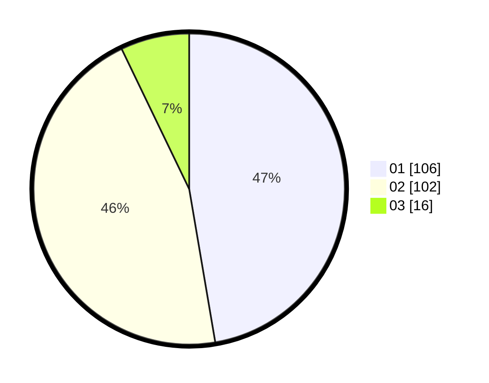

# Hasil

Hasil perolehan suara paslon dapat dilihat pada file paslon-01.txt, paslon-02.txt, dan paslon-03.txt.

Jika tidak ada, artinya data tersebut belum ada pada SIREKAP.

## Perolehan Suara

 * Paslon 01: **106**.
 * Paslon 02: **102**.
 * Paslon 03: **16**.

## Foto C Plano

https://sirekap-obj-formc.kpu.go.id/029d/pemilu/ppwp/31/73/06/10/01/3173061001077-20240214-214758--52dd7b05-56da-4add-8500-08627c3f741a.jpg

https://sirekap-obj-formc.kpu.go.id/029d/pemilu/ppwp/31/73/06/10/01/3173061001077-20240215-192651--0b631f40-a7a4-4e14-8dcd-7b103a80a216.jpg

https://sirekap-obj-formc.kpu.go.id/029d/pemilu/ppwp/31/73/06/10/01/3173061001077-20240215-192728--88d429ba-0210-4fa2-8d22-399fd1aa6198.jpg

## DATA PEMILIH TETAP

Jumlah pemilih dalam DPT: **276**.
 * L: **138**.
 * P: **138**.

## DATA PENGGUNA HAK PILIH

Jumlah pengguna hak pilih dalam DPT: **224**.
 * L: **110**.
 * P: **114**.

Jumlah pengguna hak pilih dalam DPTb: **2**.
 * L: **1**.
 * P: **1**.

Jumlah pengguna hak pilih dalam DPK: **0**.
 * L: **0**.
 * P: **0**.

Jumlah pengguna hak pilih: **226**.
 * L: **111**.
 * P: **115**.

## JUMLAH SUARA SAH DAN TIDAK SAH

JUMLAH SELURUH SUARA SAH: **224**.

JUMLAH SUARA TIDAK SAH: **2**.

JUMLAH SELURUH SUARA SAH DAN SUARA TIDAK SAH: **226**.
