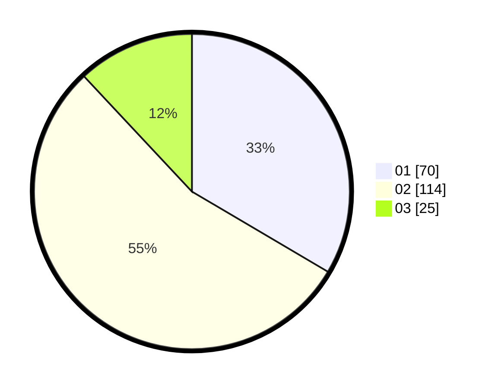

# Hasil

Hasil perolehan suara paslon dapat dilihat pada file paslon-01.txt, paslon-02.txt, dan paslon-03.txt.

Jika tidak ada, artinya data tersebut belum ada pada SIREKAP.

## Perolehan Suara

 * Paslon 01: **70**.
 * Paslon 02: **114**.
 * Paslon 03: **25**.

## Foto C Plano

https://sirekap-obj-formc.kpu.go.id/6b25/pemilu/ppwp/31/73/06/10/01/3173061001079-20240215-225436--d9a742c9-324c-4063-b598-c87d51314809.jpg

https://sirekap-obj-formc.kpu.go.id/6b25/pemilu/ppwp/31/73/06/10/01/3173061001079-20240215-225439--2e67659d-41cc-42ec-a73e-146ba7009e0c.jpg

https://sirekap-obj-formc.kpu.go.id/6b25/pemilu/ppwp/31/73/06/10/01/3173061001079-20240215-225438--2d655c6d-89d0-475a-b91d-6b3cb7596e8a.jpg

## DATA PEMILIH TETAP

Jumlah pemilih dalam DPT: **268**.
 * L: **129**.
 * P: **139**.

## DATA PENGGUNA HAK PILIH

Jumlah pengguna hak pilih dalam DPT: **215**.
 * L: **106**.
 * P: **109**.

Jumlah pengguna hak pilih dalam DPTb: **0**.
 * L: **0**.
 * P: **0**.

Jumlah pengguna hak pilih dalam DPK: **0**.
 * L: **0**.
 * P: **0**.

Jumlah pengguna hak pilih: **215**.
 * L: **106**.
 * P: **109**.

## JUMLAH SUARA SAH DAN TIDAK SAH

JUMLAH SELURUH SUARA SAH: **209**.

JUMLAH SUARA TIDAK SAH: **6**.

JUMLAH SELURUH SUARA SAH DAN SUARA TIDAK SAH: **215**.
