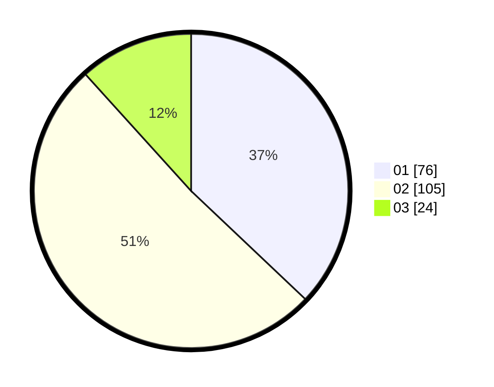

# Hasil

Hasil perolehan suara paslon dapat dilihat pada file paslon-01.txt, paslon-02.txt, dan paslon-03.txt.

Jika tidak ada, artinya data tersebut belum ada pada SIREKAP.

## Perolehan Suara

 * Paslon 01: **76**.
 * Paslon 02: **105**.
 * Paslon 03: **24**.

## Foto C Plano

https://sirekap-obj-formc.kpu.go.id/b986/pemilu/ppwp/31/73/06/10/01/3173061001082-20240215-235650--a7e2207f-06b5-4e9c-8788-c787940d4b4c.jpg

https://sirekap-obj-formc.kpu.go.id/b986/pemilu/ppwp/31/73/06/10/01/3173061001082-20240215-235651--35ab51e1-8924-474d-b883-07d87c4a403c.jpg

https://sirekap-obj-formc.kpu.go.id/b986/pemilu/ppwp/31/73/06/10/01/3173061001082-20240215-235651--d18baca6-7720-4b87-8ac1-55480ab38424.jpg

## DATA PEMILIH TETAP

Jumlah pemilih dalam DPT: **257**.
 * L: **124**.
 * P: **133**.

## DATA PENGGUNA HAK PILIH

Jumlah pengguna hak pilih dalam DPT: **207**.
 * L: **98**.
 * P: **109**.

Jumlah pengguna hak pilih dalam DPTb: **0**.
 * L: **0**.
 * P: **0**.

Jumlah pengguna hak pilih dalam DPK: **3**.
 * L: **1**.
 * P: **2**.

Jumlah pengguna hak pilih: **210**.
 * L: **99**.
 * P: **111**.

## JUMLAH SUARA SAH DAN TIDAK SAH

JUMLAH SELURUH SUARA SAH: **205**.

JUMLAH SUARA TIDAK SAH: **5**.

JUMLAH SELURUH SUARA SAH DAN SUARA TIDAK SAH: **210**.
