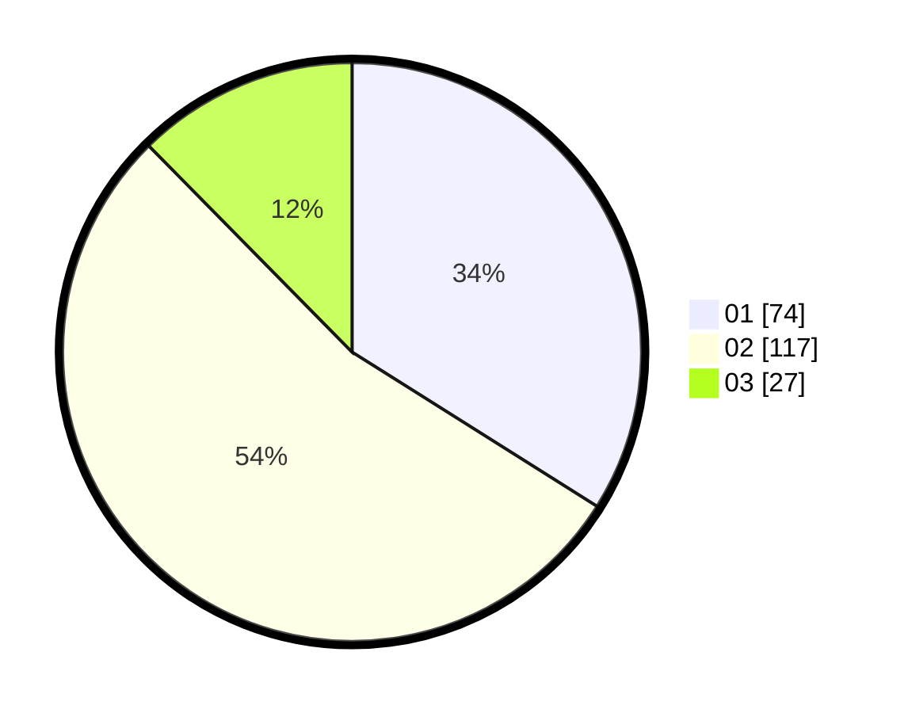

# Hasil

Hasil perolehan suara paslon dapat dilihat pada file paslon-01.txt, paslon-02.txt, dan paslon-03.txt.

Jika tidak ada, artinya data tersebut belum ada pada SIREKAP.

## Perolehan Suara

 * Paslon 01: **74**.
 * Paslon 02: **117**.
 * Paslon 03: **27**.

## Foto C Plano

https://sirekap-obj-formc.kpu.go.id/1375/pemilu/ppwp/31/73/06/10/01/3173061001085-20240214-214047--413ffe0b-700a-4bd8-8c4a-985c170b275d.jpg

https://sirekap-obj-formc.kpu.go.id/1375/pemilu/ppwp/31/73/06/10/01/3173061001085-20240214-200611--33101246-0793-4ca2-929c-76fca56d517f.jpg

https://sirekap-obj-formc.kpu.go.id/1375/pemilu/ppwp/31/73/06/10/01/3173061001085-20240214-200728--0bfb3e36-11fe-4929-9ec1-0f7e281ec9ea.jpg
