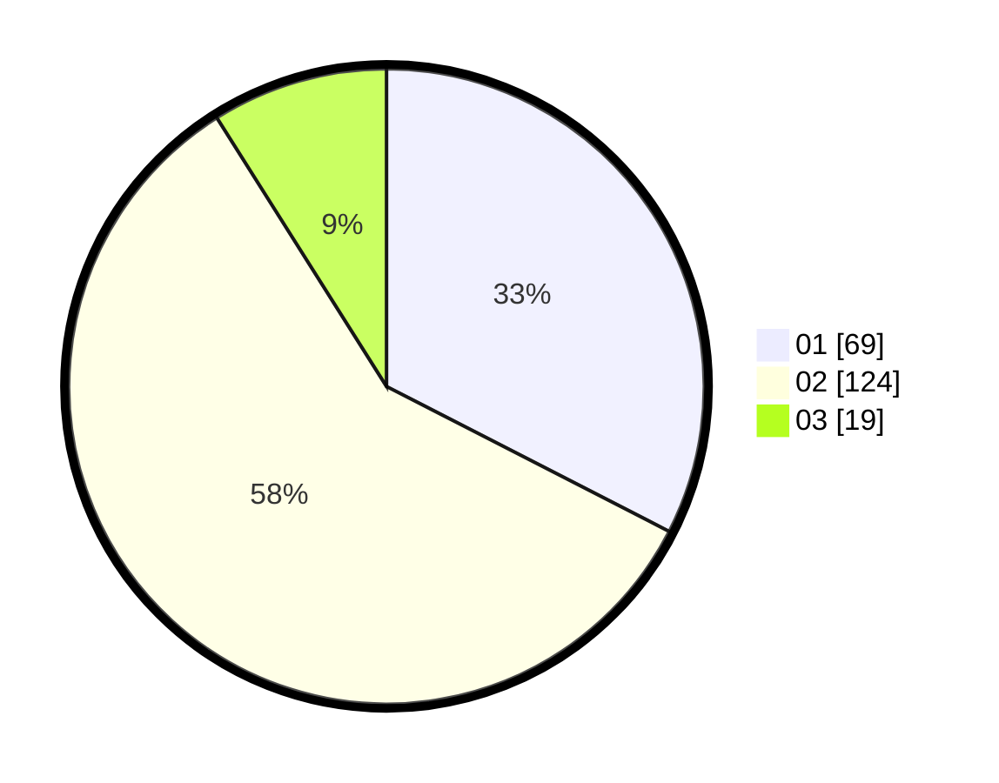

# Hasil

Hasil perolehan suara paslon dapat dilihat pada file paslon-01.txt, paslon-02.txt, dan paslon-03.txt.

Jika tidak ada, artinya data tersebut belum ada pada SIREKAP.

## Perolehan Suara

 * Paslon 01: **69**.
 * Paslon 02: **124**.
 * Paslon 03: **19**.

## Foto C Plano

https://sirekap-obj-formc.kpu.go.id/707d/pemilu/ppwp/31/73/06/10/01/3173061001087-20240214-202255--c177916a-3238-4066-b881-760d0b37e3ca.jpg

https://sirekap-obj-formc.kpu.go.id/707d/pemilu/ppwp/31/73/06/10/01/3173061001087-20240214-202451--6b96aacb-fd9e-41ad-a3c5-499f8e7e36c2.jpg

https://sirekap-obj-formc.kpu.go.id/707d/pemilu/ppwp/31/73/06/10/01/3173061001087-20240214-202623--6837c769-c5f4-4091-b056-0e10265d0a4a.jpg

## DATA PEMILIH TETAP

Jumlah pemilih dalam DPT: **260**.
 * L: **135**.
 * P: **125**.

## DATA PENGGUNA HAK PILIH

Jumlah pengguna hak pilih dalam DPT: **212**.
 * L: **112**.
 * P: **100**.

Jumlah pengguna hak pilih dalam DPTb: **1**.
 * L: **0**.
 * P: **1**.

Jumlah pengguna hak pilih dalam DPK: **0**.
 * L: **0**.
 * P: **0**.

Jumlah pengguna hak pilih: **213**.
 * L: **112**.
 * P: **101**.

## JUMLAH SUARA SAH DAN TIDAK SAH

JUMLAH SELURUH SUARA SAH: **212**.

JUMLAH SUARA TIDAK SAH: **1**.

JUMLAH SELURUH SUARA SAH DAN SUARA TIDAK SAH: **213**.
