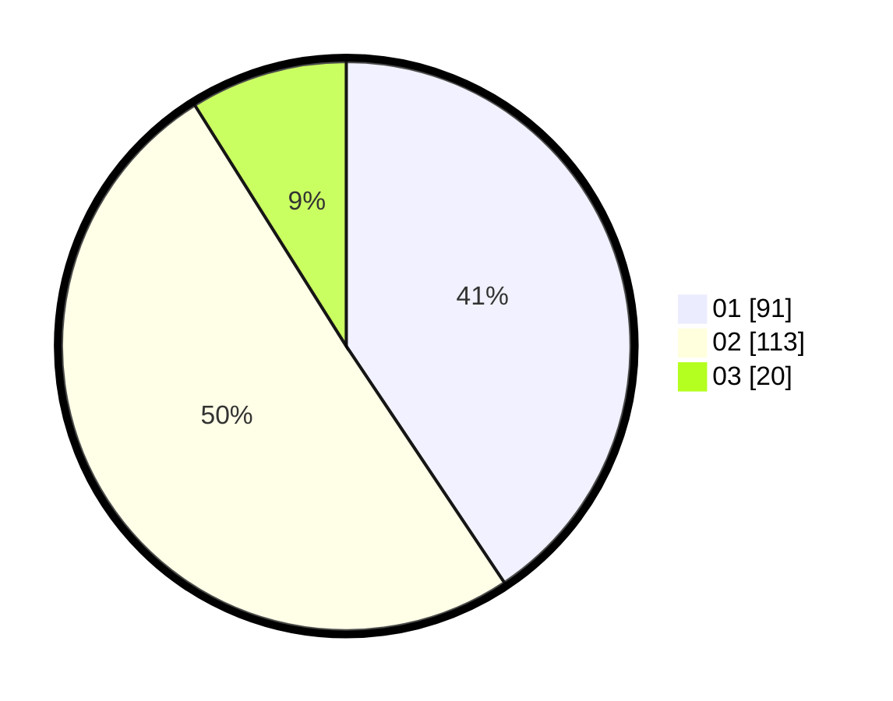

# Hasil

Hasil perolehan suara paslon dapat dilihat pada file paslon-01.txt, paslon-02.txt, dan paslon-03.txt.

Jika tidak ada, artinya data tersebut belum ada pada SIREKAP.

## Perolehan Suara

 * Paslon 01: **91**.
 * Paslon 02: **113**.
 * Paslon 03: **20**.

## Foto C Plano

https://sirekap-obj-formc.kpu.go.id/4b2f/pemilu/ppwp/31/73/06/10/01/3173061001090-20240214-194211--7287a113-afa7-4a8d-a693-b830b33b9fb8.jpg

https://sirekap-obj-formc.kpu.go.id/4b2f/pemilu/ppwp/31/73/06/10/01/3173061001090-20240214-193346--3e5924dd-9958-4f78-b023-ac0fa079ee07.jpg

https://sirekap-obj-formc.kpu.go.id/4b2f/pemilu/ppwp/31/73/06/10/01/3173061001090-20240214-193924--bd1b67b0-819a-4ace-81c0-e5967e7a7df5.jpg

## DATA PEMILIH TETAP

Jumlah pemilih dalam DPT: **272**.
 * L: **141**.
 * P: **131**.

## DATA PENGGUNA HAK PILIH

Jumlah pengguna hak pilih dalam DPT: **272**.
 * L: **141**.
 * P: **131**.

Jumlah pengguna hak pilih dalam DPTb: **3**.
 * L: **2**.
 * P: **1**.

Jumlah pengguna hak pilih dalam DPK: **3**.
 * L: **0**.
 * P: **3**.

Jumlah pengguna hak pilih: **278**.
 * L: **143**.
 * P: **135**.

## JUMLAH SUARA SAH DAN TIDAK SAH

JUMLAH SELURUH SUARA SAH: **224**.

JUMLAH SUARA TIDAK SAH: **5**.

JUMLAH SELURUH SUARA SAH DAN SUARA TIDAK SAH: **229**.
