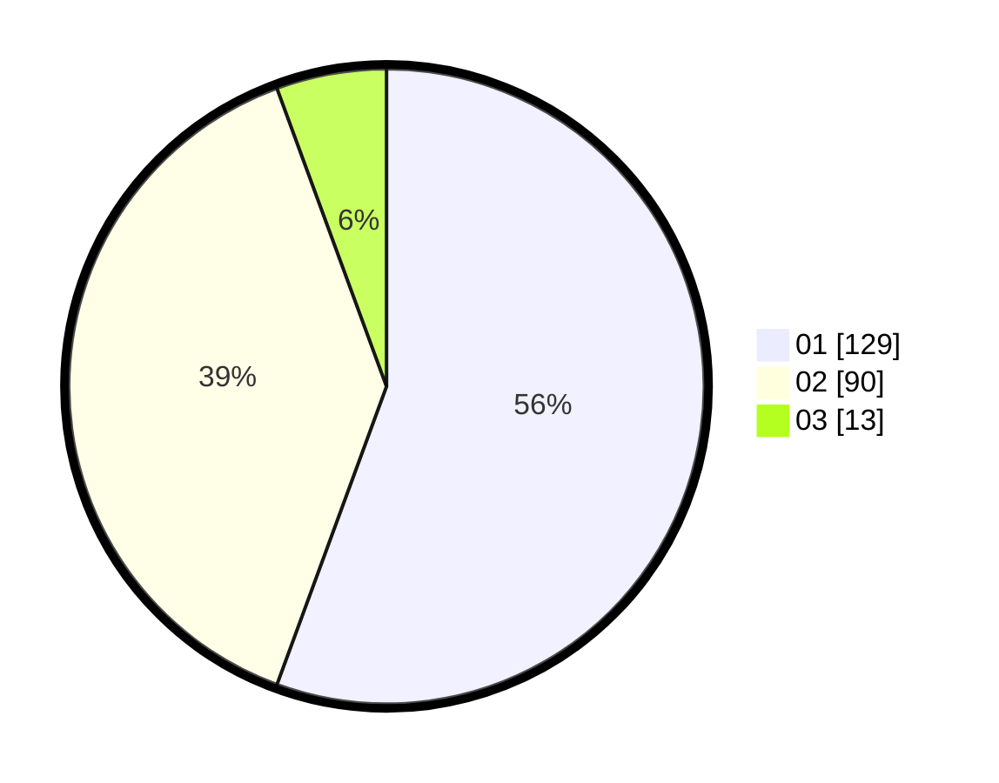

# Hasil

Hasil perolehan suara paslon dapat dilihat pada file paslon-01.txt, paslon-02.txt, dan paslon-03.txt.

Jika tidak ada, artinya data tersebut belum ada pada SIREKAP.

## Perolehan Suara

 * Paslon 01: **129**.
 * Paslon 02: **90**.
 * Paslon 03: **13**.

## Foto C Plano

https://sirekap-obj-formc.kpu.go.id/e580/pemilu/ppwp/31/73/06/10/01/3173061001092-20240216-002947--d0e3beac-8058-4573-8110-b8112cd93766.jpg

https://sirekap-obj-formc.kpu.go.id/e580/pemilu/ppwp/31/73/06/10/01/3173061001092-20240216-002949--3d137702-a1b2-40fe-a9fa-20b24badce3a.jpg

https://sirekap-obj-formc.kpu.go.id/e580/pemilu/ppwp/31/73/06/10/01/3173061001092-20240216-002948--e401d00b-902b-4b61-9268-960b6546fcb8.jpg

## DATA PEMILIH TETAP

Jumlah pemilih dalam DPT: **273**.
 * L: **138**.
 * P: **135**.

## DATA PENGGUNA HAK PILIH

Jumlah pengguna hak pilih dalam DPT: **226**.
 * L: **116**.
 * P: **110**.

Jumlah pengguna hak pilih dalam DPTb: **5**.
 * L: **2**.
 * P: **3**.

Jumlah pengguna hak pilih dalam DPK: **6**.
 * L: **3**.
 * P: **3**.

Jumlah pengguna hak pilih: **237**.
 * L: **121**.
 * P: **116**.

## JUMLAH SUARA SAH DAN TIDAK SAH

JUMLAH SELURUH SUARA SAH: **232**.

JUMLAH SUARA TIDAK SAH: **5**.

JUMLAH SELURUH SUARA SAH DAN SUARA TIDAK SAH: **237**.
