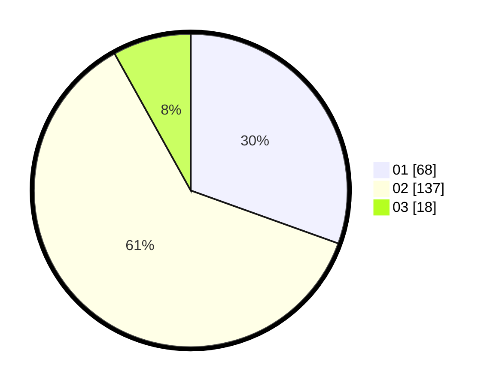

# Hasil

Hasil perolehan suara paslon dapat dilihat pada file paslon-01.txt, paslon-02.txt, dan paslon-03.txt.

Jika tidak ada, artinya data tersebut belum ada pada SIREKAP.

## Perolehan Suara

 * Paslon 01: **68**.
 * Paslon 02: **137**.
 * Paslon 03: **18**.

## Foto C Plano

https://sirekap-obj-formc.kpu.go.id/2016/pemilu/ppwp/31/73/06/10/01/3173061001093-20240214-210228--ac6e2cac-16df-4cee-a18f-21e343986f74.jpg

https://sirekap-obj-formc.kpu.go.id/2016/pemilu/ppwp/31/73/06/10/01/3173061001093-20240214-211513--052e8a3a-3ca3-4767-a868-a9fe2dd4d1d3.jpg
