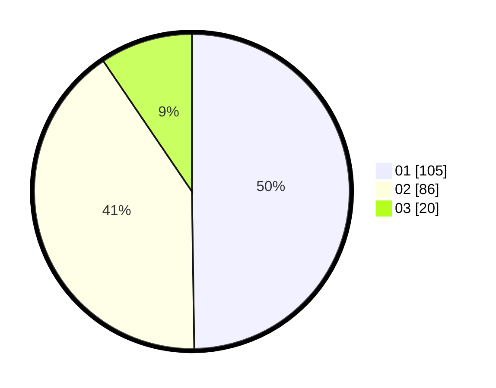

# Hasil

Hasil perolehan suara paslon dapat dilihat pada file paslon-01.txt, paslon-02.txt, dan paslon-03.txt.

Jika tidak ada, artinya data tersebut belum ada pada SIREKAP.

## Perolehan Suara

 * Paslon 01: **105**.
 * Paslon 02: **86**.
 * Paslon 03: **20**.

## Foto C Plano

https://sirekap-obj-formc.kpu.go.id/328c/pemilu/ppwp/31/73/06/10/01/3173061001095-20240216-043555--15c6670c-3006-4f7f-a845-f6bc0962a986.jpg

https://sirekap-obj-formc.kpu.go.id/328c/pemilu/ppwp/31/73/06/10/01/3173061001095-20240216-043557--12091d6c-680b-462c-96b8-b44ad162c931.jpg

https://sirekap-obj-formc.kpu.go.id/328c/pemilu/ppwp/31/73/06/10/01/3173061001095-20240216-043556--8eb335d3-a99b-48ea-9a41-a048d4f29c23.jpg

## DATA PEMILIH TETAP

Jumlah pemilih dalam DPT: **285**.
 * L: **142**.
 * P: **143**.

## DATA PENGGUNA HAK PILIH

Jumlah pengguna hak pilih dalam DPT: **207**.
 * L: **97**.
 * P: **110**.

Jumlah pengguna hak pilih dalam DPTb: **0**.
 * L: **0**.
 * P: **0**.

Jumlah pengguna hak pilih dalam DPK: **5**.
 * L: **3**.
 * P: **2**.

Jumlah pengguna hak pilih: **212**.
 * L: **100**.
 * P: **112**.

## JUMLAH SUARA SAH DAN TIDAK SAH

JUMLAH SELURUH SUARA SAH: **211**.

JUMLAH SUARA TIDAK SAH: **1**.

JUMLAH SELURUH SUARA SAH DAN SUARA TIDAK SAH: **212**.
