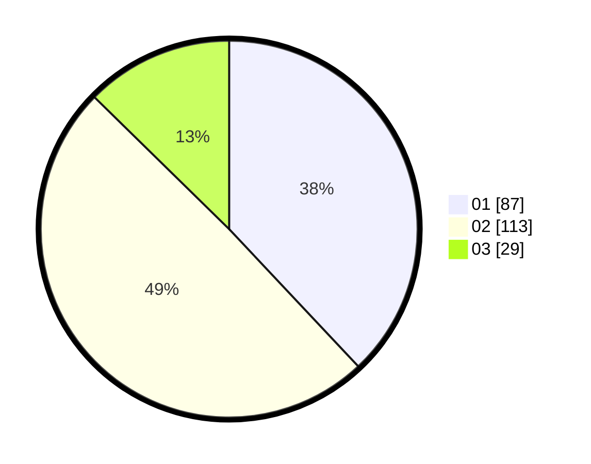

# Hasil

Hasil perolehan suara paslon dapat dilihat pada file paslon-01.txt, paslon-02.txt, dan paslon-03.txt.

Jika tidak ada, artinya data tersebut belum ada pada SIREKAP.

## Perolehan Suara

 * Paslon 01: **87**.
 * Paslon 02: **113**.
 * Paslon 03: **29**.

## Foto C Plano

https://sirekap-obj-formc.kpu.go.id/b316/pemilu/ppwp/31/73/06/10/01/3173061001099-20240215-104830--a437f1d9-4fd7-47ae-ba89-971fdef1f673.jpg

https://sirekap-obj-formc.kpu.go.id/b316/pemilu/ppwp/31/73/06/10/01/3173061001099-20240214-185242--47877254-ae08-4ecd-b03d-d8e91f7557f0.jpg

https://sirekap-obj-formc.kpu.go.id/b316/pemilu/ppwp/31/73/06/10/01/3173061001099-20240215-104841--4b7cbc1d-5357-4456-8b40-2e78ba20f62a.jpg

## DATA PEMILIH TETAP

Jumlah pemilih dalam DPT: **275**.
 * L: **140**.
 * P: **135**.

## DATA PENGGUNA HAK PILIH

Jumlah pengguna hak pilih dalam DPT: **229**.
 * L: **113**.
 * P: **116**.

Jumlah pengguna hak pilih dalam DPTb: **0**.
 * L: **0**.
 * P: **0**.

Jumlah pengguna hak pilih dalam DPK: **1**.
 * L: **0**.
 * P: **1**.

Jumlah pengguna hak pilih: **230**.
 * L: **113**.
 * P: **117**.

## JUMLAH SUARA SAH DAN TIDAK SAH

JUMLAH SELURUH SUARA SAH: **229**.

JUMLAH SUARA TIDAK SAH: **1**.

JUMLAH SELURUH SUARA SAH DAN SUARA TIDAK SAH: **230**.
