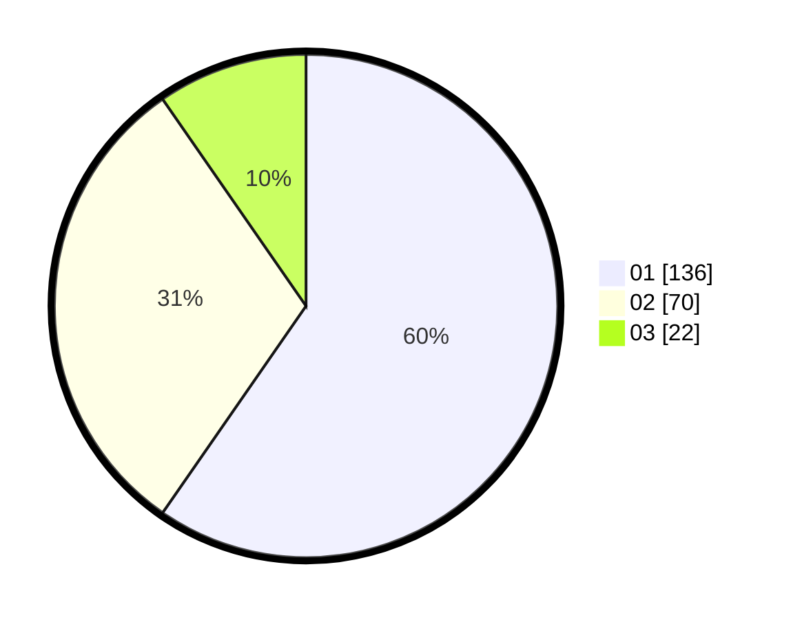

# Hasil

Hasil perolehan suara paslon dapat dilihat pada file paslon-01.txt, paslon-02.txt, dan paslon-03.txt.

Jika tidak ada, artinya data tersebut belum ada pada SIREKAP.

## Perolehan Suara

 * Paslon 01: **136**.
 * Paslon 02: **70**.
 * Paslon 03: **22**.

## Foto C Plano

https://sirekap-obj-formc.kpu.go.id/3000/pemilu/ppwp/31/73/06/10/01/3173061001101-20240216-001053--c38e4c15-5bb8-46e7-a2af-161331f0aee3.jpg

https://sirekap-obj-formc.kpu.go.id/3000/pemilu/ppwp/31/73/06/10/01/3173061001101-20240216-001056--c6d655b5-a832-4027-baaf-aea233e5a57a.jpg

https://sirekap-obj-formc.kpu.go.id/3000/pemilu/ppwp/31/73/06/10/01/3173061001101-20240216-001054--f3cff3f7-5493-43b1-bff0-7b002c02ff88.jpg

## DATA PEMILIH TETAP

Jumlah pemilih dalam DPT: **289**.
 * L: **146**.
 * P: **143**.

## DATA PENGGUNA HAK PILIH

Jumlah pengguna hak pilih dalam DPT: **228**.
 * L: **113**.
 * P: **115**.

Jumlah pengguna hak pilih dalam DPTb: **0**.
 * L: **0**.
 * P: **0**.

Jumlah pengguna hak pilih dalam DPK: **0**.
 * L: **0**.
 * P: **0**.

Jumlah pengguna hak pilih: **228**.
 * L: **113**.
 * P: **115**.

## JUMLAH SUARA SAH DAN TIDAK SAH

JUMLAH SELURUH SUARA SAH: **228**.

JUMLAH SUARA TIDAK SAH: **0**.

JUMLAH SELURUH SUARA SAH DAN SUARA TIDAK SAH: **228**.
