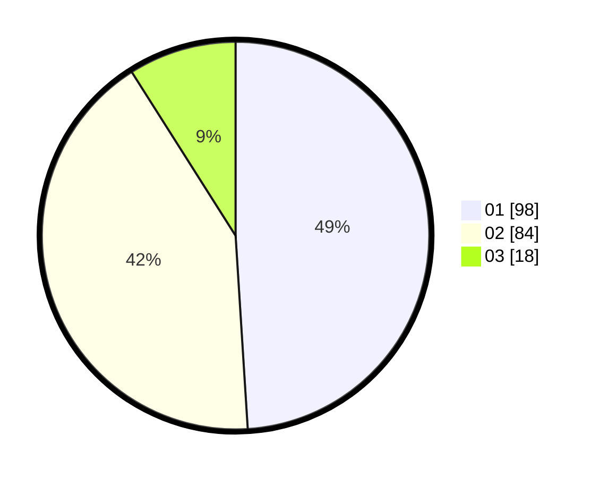

# Hasil

Hasil perolehan suara paslon dapat dilihat pada file paslon-01.txt, paslon-02.txt, dan paslon-03.txt.

Jika tidak ada, artinya data tersebut belum ada pada SIREKAP.

## Perolehan Suara

 * Paslon 01: **98**.
 * Paslon 02: **84**.
 * Paslon 03: **18**.

## Foto C Plano

https://sirekap-obj-formc.kpu.go.id/f5e4/pemilu/ppwp/31/73/06/10/01/3173061001102-20240216-134731--2c1428f5-b7eb-412c-b0d2-072170eb0a68.jpg

https://sirekap-obj-formc.kpu.go.id/f5e4/pemilu/ppwp/31/73/06/10/01/3173061001102-20240216-134733--a58d0398-f9fb-44c2-a382-d10b0729100a.jpg

https://sirekap-obj-formc.kpu.go.id/f5e4/pemilu/ppwp/31/73/06/10/01/3173061001102-20240216-134732--605f2489-3996-4e7a-88cd-fa12714493e8.jpg

## DATA PEMILIH TETAP

Jumlah pemilih dalam DPT: **288**.
 * L: **149**.
 * P: **139**.

## DATA PENGGUNA HAK PILIH

Jumlah pengguna hak pilih dalam DPT: **202**.
 * L: **101**.
 * P: **101**.

Jumlah pengguna hak pilih dalam DPTb: **0**.
 * L: **0**.
 * P: **0**.

Jumlah pengguna hak pilih dalam DPK: **0**.
 * L: **0**.
 * P: **0**.

Jumlah pengguna hak pilih: **202**.
 * L: **101**.
 * P: **101**.

## JUMLAH SUARA SAH DAN TIDAK SAH

JUMLAH SELURUH SUARA SAH: **200**.

JUMLAH SUARA TIDAK SAH: **2**.

JUMLAH SELURUH SUARA SAH DAN SUARA TIDAK SAH: **202**.
