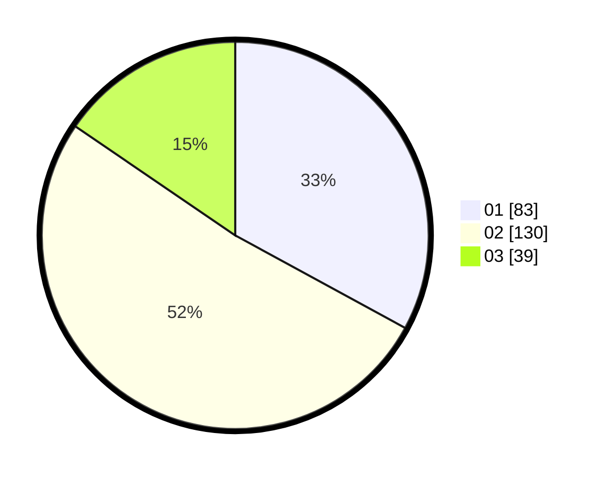

# Hasil

Hasil perolehan suara paslon dapat dilihat pada file paslon-01.txt, paslon-02.txt, dan paslon-03.txt.

Jika tidak ada, artinya data tersebut belum ada pada SIREKAP.

## Perolehan Suara

 * Paslon 01: **83**.
 * Paslon 02: **130**.
 * Paslon 03: **39**.

## Foto C Plano

https://sirekap-obj-formc.kpu.go.id/9757/pemilu/ppwp/31/73/06/10/01/3173061001109-20240214-192128--bfdd11ce-07ac-453f-a39c-1830bfdf93a6.jpg

https://sirekap-obj-formc.kpu.go.id/9757/pemilu/ppwp/31/73/06/10/01/3173061001109-20240214-192136--a6ec19f7-6bc0-4c46-8bf5-3212e421afab.jpg

https://sirekap-obj-formc.kpu.go.id/9757/pemilu/ppwp/31/73/06/10/01/3173061001109-20240214-192141--a03bc782-a4b3-453f-816a-2b4db1fe39d9.jpg

## DATA PEMILIH TETAP

Jumlah pemilih dalam DPT: **296**.
 * L: **156**.
 * P: **140**.

## DATA PENGGUNA HAK PILIH

Jumlah pengguna hak pilih dalam DPT: **240**.
 * L: **118**.
 * P: **122**.

Jumlah pengguna hak pilih dalam DPTb: **2**.
 * L: **1**.
 * P: **1**.

Jumlah pengguna hak pilih dalam DPK: **11**.
 * L: **4**.
 * P: **7**.

Jumlah pengguna hak pilih: **253**.
 * L: **123**.
 * P: **130**.

## JUMLAH SUARA SAH DAN TIDAK SAH

JUMLAH SELURUH SUARA SAH: **252**.

JUMLAH SUARA TIDAK SAH: **1**.

JUMLAH SELURUH SUARA SAH DAN SUARA TIDAK SAH: **253**.
