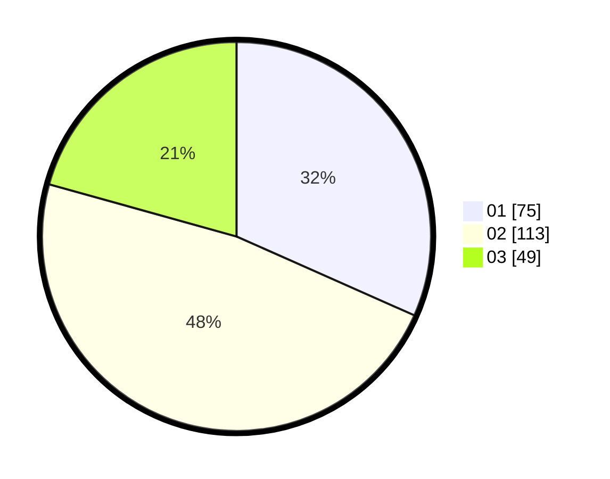

# Hasil

Hasil perolehan suara paslon dapat dilihat pada file paslon-01.txt, paslon-02.txt, dan paslon-03.txt.

Jika tidak ada, artinya data tersebut belum ada pada SIREKAP.

## Perolehan Suara

 * Paslon 01: **75**.
 * Paslon 02: **113**.
 * Paslon 03: **49**.

## Foto C Plano

https://sirekap-obj-formc.kpu.go.id/e336/pemilu/ppwp/31/73/06/10/01/3173061001110-20240214-155230--88cc3976-281f-47a6-876e-5fdb1bbc5a40.jpg

https://sirekap-obj-formc.kpu.go.id/e336/pemilu/ppwp/31/73/06/10/01/3173061001110-20240214-155326--4aea828c-5d8c-480d-9612-c30c4c43823d.jpg

https://sirekap-obj-formc.kpu.go.id/e336/pemilu/ppwp/31/73/06/10/01/3173061001110-20240214-155433--0952516f-3096-4dd8-aac3-a46e8f842913.jpg

## DATA PEMILIH TETAP

Jumlah pemilih dalam DPT: **298**.
 * L: **156**.
 * P: **142**.

## DATA PENGGUNA HAK PILIH

Jumlah pengguna hak pilih dalam DPT: **239**.
 * L: **124**.
 * P: **115**.

Jumlah pengguna hak pilih dalam DPTb: **3**.
 * L: **0**.
 * P: **3**.

Jumlah pengguna hak pilih dalam DPK: **0**.
 * L: **0**.
 * P: **0**.

Jumlah pengguna hak pilih: **242**.
 * L: **124**.
 * P: **118**.

## JUMLAH SUARA SAH DAN TIDAK SAH

JUMLAH SELURUH SUARA SAH: **237**.

JUMLAH SUARA TIDAK SAH: **5**.

JUMLAH SELURUH SUARA SAH DAN SUARA TIDAK SAH: **242**.
