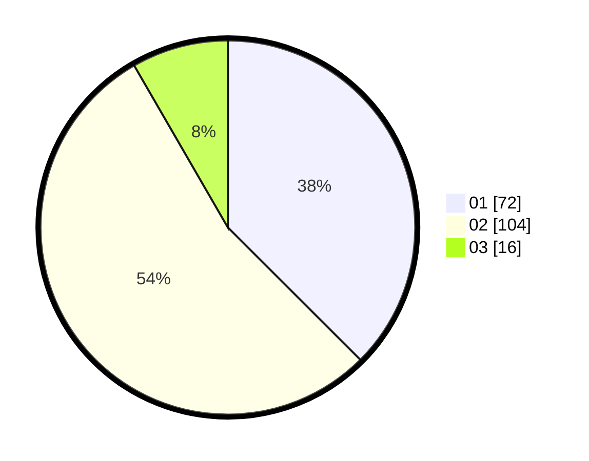

# Hasil

Hasil perolehan suara paslon dapat dilihat pada file paslon-01.txt, paslon-02.txt, dan paslon-03.txt.

Jika tidak ada, artinya data tersebut belum ada pada SIREKAP.

## Perolehan Suara

 * Paslon 01: **72**.
 * Paslon 02: **104**.
 * Paslon 03: **16**.

## Foto C Plano

https://sirekap-obj-formc.kpu.go.id/1c76/pemilu/ppwp/31/73/06/10/01/3173061001111-20240214-214233--7108481e-a948-4dce-92ef-d396ae1e9f23.jpg

https://sirekap-obj-formc.kpu.go.id/1c76/pemilu/ppwp/31/73/06/10/01/3173061001111-20240214-210539--184871d9-754c-4105-b69a-7c2e1b9c028c.jpg

https://sirekap-obj-formc.kpu.go.id/1c76/pemilu/ppwp/31/73/06/10/01/3173061001111-20240214-210621--abb8766c-8657-4082-865f-1c7a01413d11.jpg

## DATA PEMILIH TETAP

Jumlah pemilih dalam DPT: **298**.
 * L: **141**.
 * P: **157**.

## DATA PENGGUNA HAK PILIH

Jumlah pengguna hak pilih dalam DPT: **192**.
 * L: **86**.
 * P: **106**.

Jumlah pengguna hak pilih dalam DPTb: **0**.
 * L: **0**.
 * P: **0**.

Jumlah pengguna hak pilih dalam DPK: **1**.
 * L: **0**.
 * P: **1**.

Jumlah pengguna hak pilih: **193**.
 * L: **86**.
 * P: **107**.

## JUMLAH SUARA SAH DAN TIDAK SAH

JUMLAH SELURUH SUARA SAH: **192**.

JUMLAH SUARA TIDAK SAH: **1**.

JUMLAH SELURUH SUARA SAH DAN SUARA TIDAK SAH: **193**.
