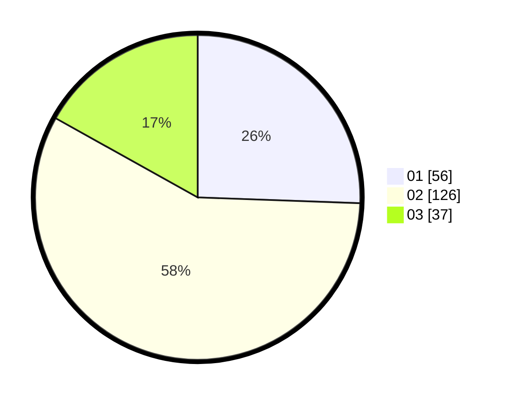

# Hasil

Hasil perolehan suara paslon dapat dilihat pada file paslon-01.txt, paslon-02.txt, dan paslon-03.txt.

Jika tidak ada, artinya data tersebut belum ada pada SIREKAP.

## Perolehan Suara

 * Paslon 01: **56**.
 * Paslon 02: **126**.
 * Paslon 03: **37**.

## Foto C Plano

https://sirekap-obj-formc.kpu.go.id/e8f9/pemilu/ppwp/31/73/06/10/01/3173061001113-20240214-220234--4ff0ed70-df14-4ca0-851c-7e4f7d271c81.jpg

https://sirekap-obj-formc.kpu.go.id/e8f9/pemilu/ppwp/31/73/06/10/01/3173061001113-20240214-220453--d041b042-1452-463d-bb7f-1275a5eb80dc.jpg

https://sirekap-obj-formc.kpu.go.id/e8f9/pemilu/ppwp/31/73/06/10/01/3173061001113-20240214-220750--3e0fca6b-df65-4639-89f2-54fc661b468f.jpg
