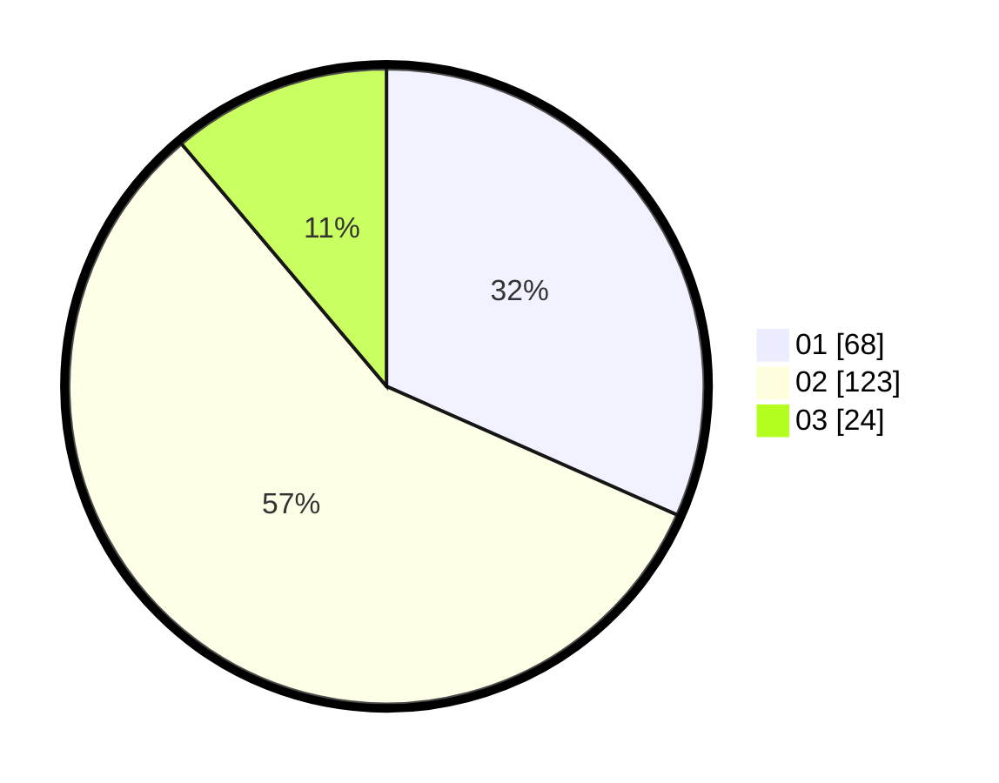

# Hasil

Hasil perolehan suara paslon dapat dilihat pada file paslon-01.txt, paslon-02.txt, dan paslon-03.txt.

Jika tidak ada, artinya data tersebut belum ada pada SIREKAP.

## Perolehan Suara

 * Paslon 01: **68**.
 * Paslon 02: **123**.
 * Paslon 03: **24**.

## Foto C Plano

https://sirekap-obj-formc.kpu.go.id/641a/pemilu/ppwp/31/73/06/10/01/3173061001114-20240214-201111--bd8da7ff-fee1-465d-b719-25823aebf125.jpg

https://sirekap-obj-formc.kpu.go.id/641a/pemilu/ppwp/31/73/06/10/01/3173061001114-20240214-201423--98fb3db3-336b-43e8-96d4-7d3d9ce89733.jpg

https://sirekap-obj-formc.kpu.go.id/641a/pemilu/ppwp/31/73/06/10/01/3173061001114-20240214-201629--07538404-7e8a-416c-b631-8129a616aa4e.jpg

## DATA PEMILIH TETAP

Jumlah pemilih dalam DPT: **277**.
 * L: **135**.
 * P: **142**.

## DATA PENGGUNA HAK PILIH

Jumlah pengguna hak pilih dalam DPT: **220**.
 * L: **104**.
 * P: **116**.

Jumlah pengguna hak pilih dalam DPTb: **0**.
 * L: **0**.
 * P: **0**.

Jumlah pengguna hak pilih dalam DPK: **1**.
 * L: **1**.
 * P: **0**.

Jumlah pengguna hak pilih: **221**.
 * L: **105**.
 * P: **116**.

## JUMLAH SUARA SAH DAN TIDAK SAH

JUMLAH SELURUH SUARA SAH: **215**.

JUMLAH SUARA TIDAK SAH: **6**.

JUMLAH SELURUH SUARA SAH DAN SUARA TIDAK SAH: **221**.
