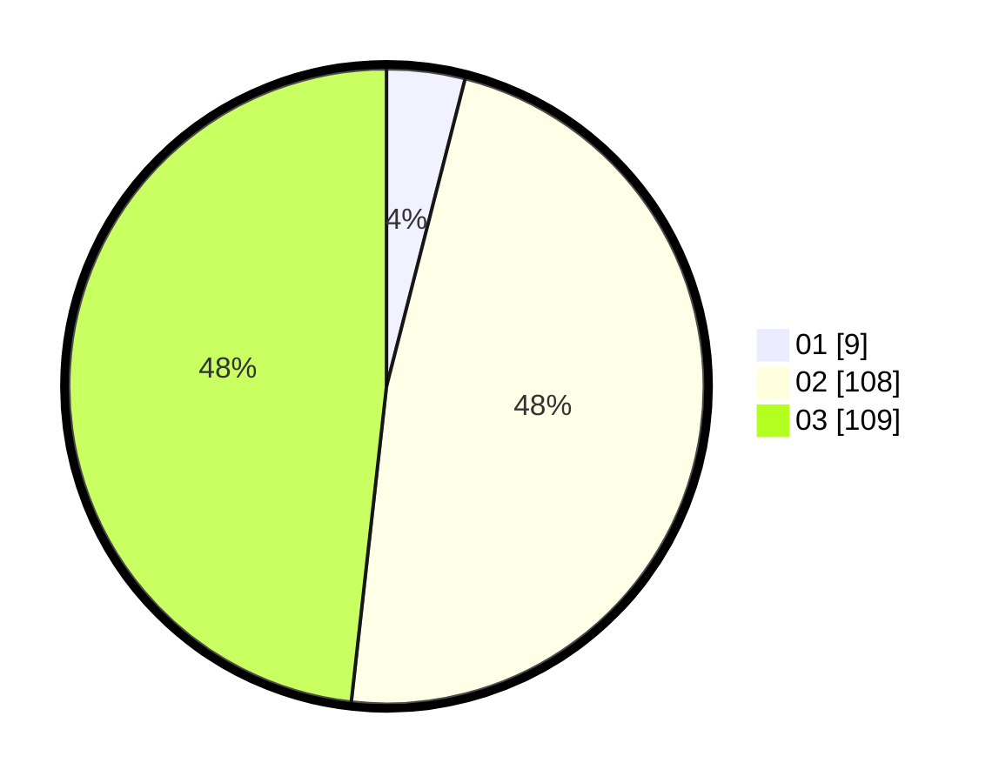

# Hasil

Hasil perolehan suara paslon dapat dilihat pada file paslon-01.txt, paslon-02.txt, dan paslon-03.txt.

Jika tidak ada, artinya data tersebut belum ada pada SIREKAP.

## Perolehan Suara

 * Paslon 01: **9**.
 * Paslon 02: **108**.
 * Paslon 03: **109**.

## Foto C Plano

https://sirekap-obj-formc.kpu.go.id/14fb/pemilu/ppwp/31/73/06/10/01/3173061001116-20240215-205424--0f49e39c-d82a-4710-b49d-684d77d57dd3.jpg

https://sirekap-obj-formc.kpu.go.id/14fb/pemilu/ppwp/31/73/06/10/01/3173061001116-20240215-205426--8a34b6fd-d5b4-4630-9589-7c4b8543c1b3.jpg

https://sirekap-obj-formc.kpu.go.id/14fb/pemilu/ppwp/31/73/06/10/01/3173061001116-20240215-205425--0ed1f7b4-391f-4ebc-8895-eae148eef7d6.jpg

## DATA PEMILIH TETAP

Jumlah pemilih dalam DPT: **282**.
 * L: **129**.
 * P: **153**.

## DATA PENGGUNA HAK PILIH

Jumlah pengguna hak pilih dalam DPT: **219**.
 * L: **99**.
 * P: **120**.

Jumlah pengguna hak pilih dalam DPTb: **8**.
 * L: **3**.
 * P: **5**.

Jumlah pengguna hak pilih dalam DPK: **0**.
 * L: **0**.
 * P: **0**.

Jumlah pengguna hak pilih: **227**.
 * L: **102**.
 * P: **125**.

## JUMLAH SUARA SAH DAN TIDAK SAH

JUMLAH SELURUH SUARA SAH: **226**.

JUMLAH SUARA TIDAK SAH: **1**.

JUMLAH SELURUH SUARA SAH DAN SUARA TIDAK SAH: **227**.
