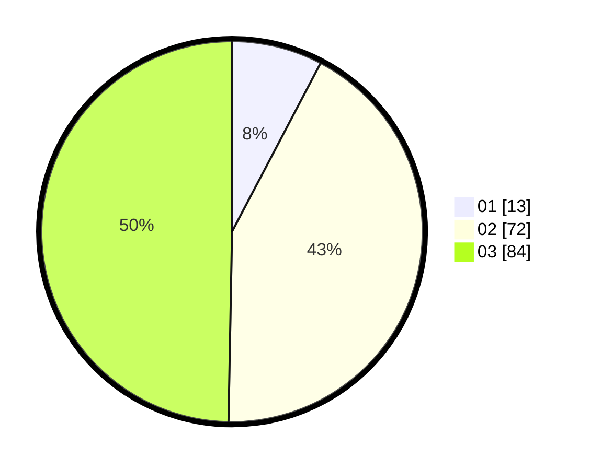

# Hasil

Hasil perolehan suara paslon dapat dilihat pada file paslon-01.txt, paslon-02.txt, dan paslon-03.txt.

Jika tidak ada, artinya data tersebut belum ada pada SIREKAP.

## Perolehan Suara

 * Paslon 01: **13**.
 * Paslon 02: **72**.
 * Paslon 03: **84**.

## Foto C Plano

https://sirekap-obj-formc.kpu.go.id/e96f/pemilu/ppwp/31/73/06/10/01/3173061001117-20240215-222431--0c8a4ebf-1c29-4f39-a825-dd722669c2d7.jpg

https://sirekap-obj-formc.kpu.go.id/e96f/pemilu/ppwp/31/73/06/10/01/3173061001117-20240215-222433--98b67386-79ab-41cc-9d07-ae8b5c617cfc.jpg

https://sirekap-obj-formc.kpu.go.id/e96f/pemilu/ppwp/31/73/06/10/01/3173061001117-20240215-222432--0bdd2b1d-3014-4959-9d64-a2753761db7c.jpg

## DATA PEMILIH TETAP

Jumlah pemilih dalam DPT: **209**.
 * L: **106**.
 * P: **103**.

## DATA PENGGUNA HAK PILIH

Jumlah pengguna hak pilih dalam DPT: **165**.
 * L: **81**.
 * P: **84**.

Jumlah pengguna hak pilih dalam DPTb: **5**.
 * L: **2**.
 * P: **3**.

Jumlah pengguna hak pilih dalam DPK: **0**.
 * L: **0**.
 * P: **0**.

Jumlah pengguna hak pilih: **170**.
 * L: **83**.
 * P: **87**.

## JUMLAH SUARA SAH DAN TIDAK SAH

JUMLAH SELURUH SUARA SAH: **169**.

JUMLAH SUARA TIDAK SAH: **1**.

JUMLAH SELURUH SUARA SAH DAN SUARA TIDAK SAH: **170**.
