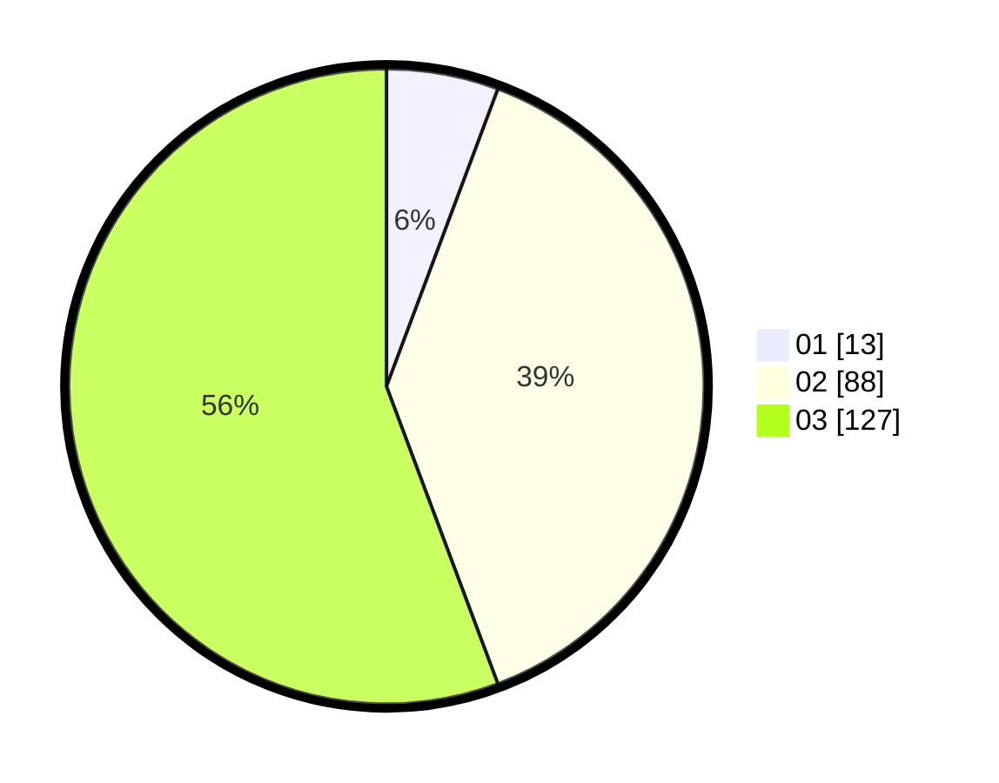

# Hasil

Hasil perolehan suara paslon dapat dilihat pada file paslon-01.txt, paslon-02.txt, dan paslon-03.txt.

Jika tidak ada, artinya data tersebut belum ada pada SIREKAP.

## Perolehan Suara

 * Paslon 01: **13**.
 * Paslon 02: **88**.
 * Paslon 03: **127**.

## Foto C Plano

https://sirekap-obj-formc.kpu.go.id/6ac3/pemilu/ppwp/31/73/06/10/01/3173061001120-20240215-121158--54f07309-7fe5-4c01-a991-181bfbbd6ecb.jpg

https://sirekap-obj-formc.kpu.go.id/6ac3/pemilu/ppwp/31/73/06/10/01/3173061001120-20240215-121201--caece296-8e35-4fb9-8476-bb081b4e53cb.jpg

https://sirekap-obj-formc.kpu.go.id/6ac3/pemilu/ppwp/31/73/06/10/01/3173061001120-20240215-121204--017f3852-3dac-47f8-9bce-314133c44426.jpg
