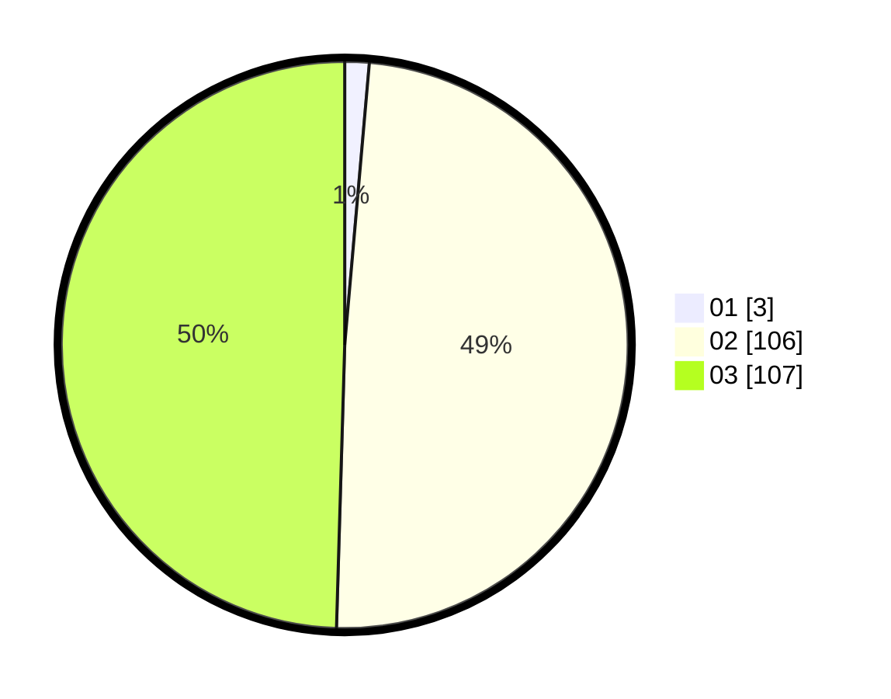

# Hasil

Hasil perolehan suara paslon dapat dilihat pada file paslon-01.txt, paslon-02.txt, dan paslon-03.txt.

Jika tidak ada, artinya data tersebut belum ada pada SIREKAP.

## Perolehan Suara

 * Paslon 01: **3**.
 * Paslon 02: **106**.
 * Paslon 03: **107**.

## Foto C Plano

https://sirekap-obj-formc.kpu.go.id/3523/pemilu/ppwp/31/73/06/10/01/3173061001121-20240214-160120--37c5c2e4-5e09-4d4a-9e6b-cb3aeffae2e8.jpg

https://sirekap-obj-formc.kpu.go.id/3523/pemilu/ppwp/31/73/06/10/01/3173061001121-20240214-155347--8b18f73b-5e6b-40a9-b47d-3dc2edd1575c.jpg
