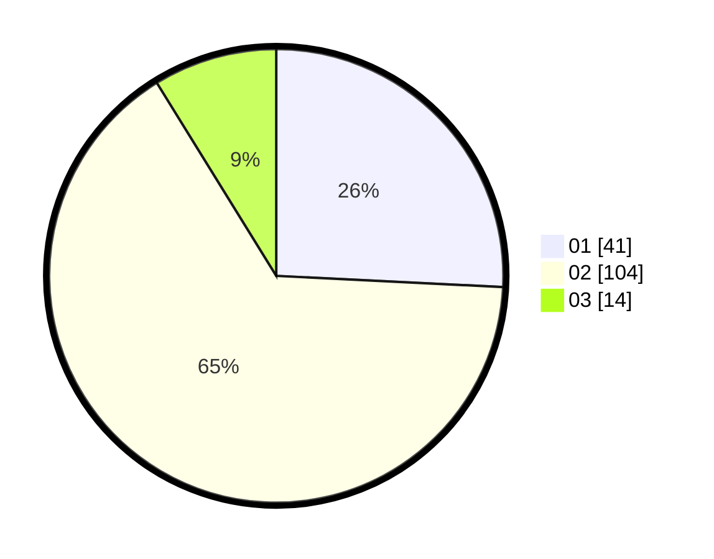

# Hasil

Hasil perolehan suara paslon dapat dilihat pada file paslon-01.txt, paslon-02.txt, dan paslon-03.txt.

Jika tidak ada, artinya data tersebut belum ada pada SIREKAP.

## Perolehan Suara

 * Paslon 01: **41**.
 * Paslon 02: **104**.
 * Paslon 03: **14**.

## Foto C Plano

https://sirekap-obj-formc.kpu.go.id/3238/pemilu/ppwp/31/73/06/10/01/3173061001133-20240216-025949--4b9694fe-2672-4fe4-ae4f-719bfb010667.jpg

https://sirekap-obj-formc.kpu.go.id/3238/pemilu/ppwp/31/73/06/10/01/3173061001133-20240216-025950--46ea0874-568e-4cef-a123-f077b8b519e9.jpg

https://sirekap-obj-formc.kpu.go.id/3238/pemilu/ppwp/31/73/06/10/01/3173061001133-20240216-025949--3493c400-bee9-4972-a7c6-ced55c697a98.jpg

## DATA PEMILIH TETAP

Jumlah pemilih dalam DPT: **201**.
 * L: **94**.
 * P: **107**.

## DATA PENGGUNA HAK PILIH

Jumlah pengguna hak pilih dalam DPT: **164**.
 * L: **75**.
 * P: **89**.

Jumlah pengguna hak pilih dalam DPTb: **0**.
 * L: **0**.
 * P: **0**.

Jumlah pengguna hak pilih dalam DPK: **0**.
 * L: **0**.
 * P: **0**.

Jumlah pengguna hak pilih: **164**.
 * L: **75**.
 * P: **89**.

## JUMLAH SUARA SAH DAN TIDAK SAH

JUMLAH SELURUH SUARA SAH: **159**.

JUMLAH SUARA TIDAK SAH: **5**.

JUMLAH SELURUH SUARA SAH DAN SUARA TIDAK SAH: **164**.
