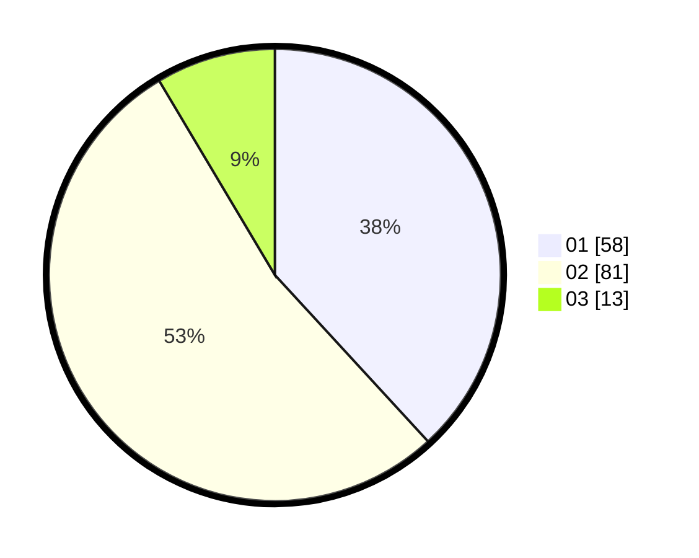

# Hasil

Hasil perolehan suara paslon dapat dilihat pada file paslon-01.txt, paslon-02.txt, dan paslon-03.txt.

Jika tidak ada, artinya data tersebut belum ada pada SIREKAP.

## Perolehan Suara

 * Paslon 01: **58**.
 * Paslon 02: **81**.
 * Paslon 03: **13**.

## Foto C Plano

https://sirekap-obj-formc.kpu.go.id/7ecc/pemilu/ppwp/31/73/06/10/01/3173061001137-20240215-220500--876bbd63-f2c9-4894-9a28-5b51e35d1eb4.jpg

https://sirekap-obj-formc.kpu.go.id/7ecc/pemilu/ppwp/31/73/06/10/01/3173061001137-20240215-220503--54eeea2f-2668-45ba-af5e-2e045b21132a.jpg

https://sirekap-obj-formc.kpu.go.id/7ecc/pemilu/ppwp/31/73/06/10/01/3173061001137-20240215-220501--810b23a4-fff1-4822-a99f-88fbe5bcdcde.jpg

## DATA PEMILIH TETAP

Jumlah pemilih dalam DPT: **199**.
 * L: **102**.
 * P: **97**.

## DATA PENGGUNA HAK PILIH

Jumlah pengguna hak pilih dalam DPT: **156**.
 * L: **78**.
 * P: **78**.

Jumlah pengguna hak pilih dalam DPTb: **0**.
 * L: **0**.
 * P: **0**.

Jumlah pengguna hak pilih dalam DPK: **0**.
 * L: **0**.
 * P: **0**.

Jumlah pengguna hak pilih: **156**.
 * L: **78**.
 * P: **78**.

## JUMLAH SUARA SAH DAN TIDAK SAH

JUMLAH SELURUH SUARA SAH: **152**.

JUMLAH SUARA TIDAK SAH: **4**.

JUMLAH SELURUH SUARA SAH DAN SUARA TIDAK SAH: **156**.
