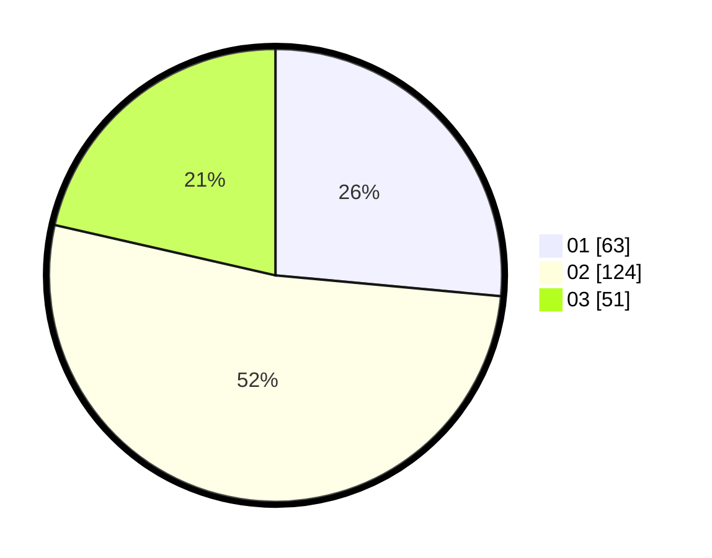

# Hasil

Hasil perolehan suara paslon dapat dilihat pada file paslon-01.txt, paslon-02.txt, dan paslon-03.txt.

Jika tidak ada, artinya data tersebut belum ada pada SIREKAP.

## Perolehan Suara

 * Paslon 01: **63**.
 * Paslon 02: **124**.
 * Paslon 03: **51**.

## Foto C Plano

https://sirekap-obj-formc.kpu.go.id/af18/pemilu/ppwp/31/73/06/10/01/3173061001141-20240219-193917--0cc47e88-0e88-4b38-bad2-d2a47cbbddd8.jpg

https://sirekap-obj-formc.kpu.go.id/af18/pemilu/ppwp/31/73/06/10/01/3173061001141-20240219-202723--44eeee65-97cc-401c-96dc-6706dd1b6079.jpg
